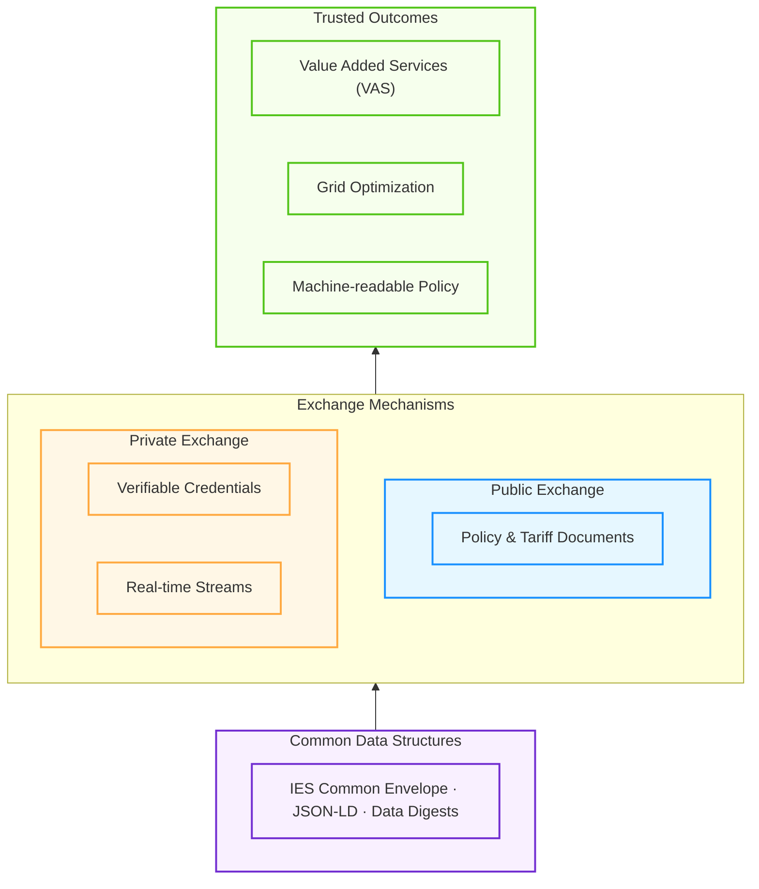
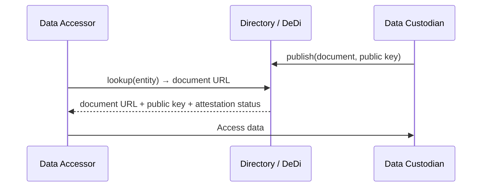
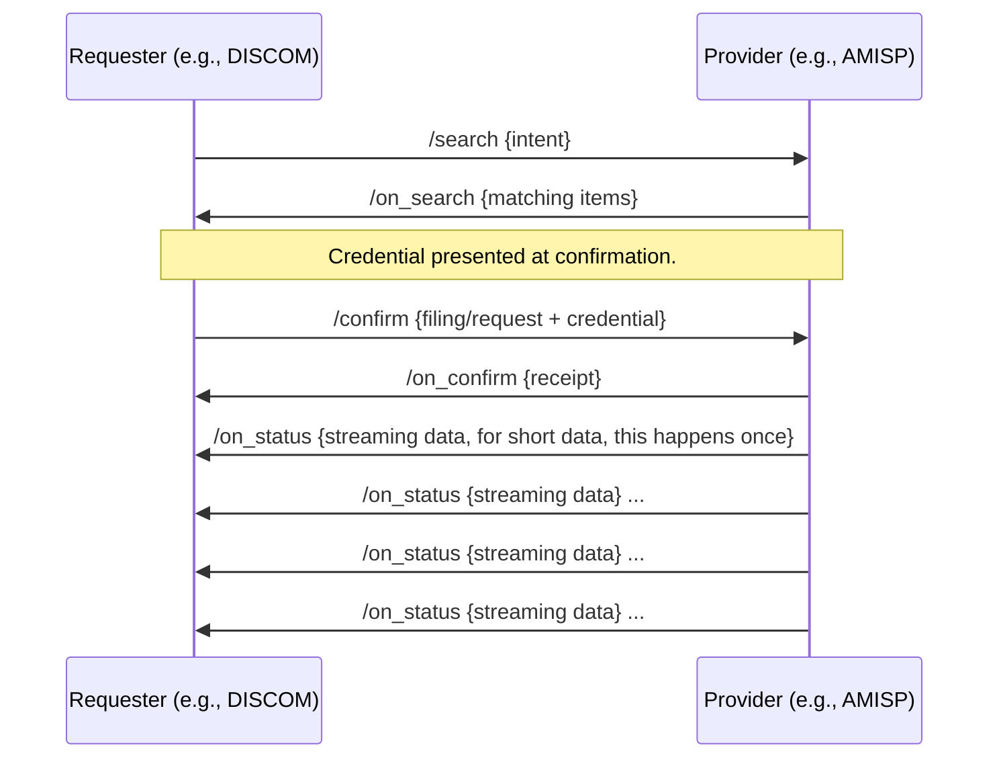
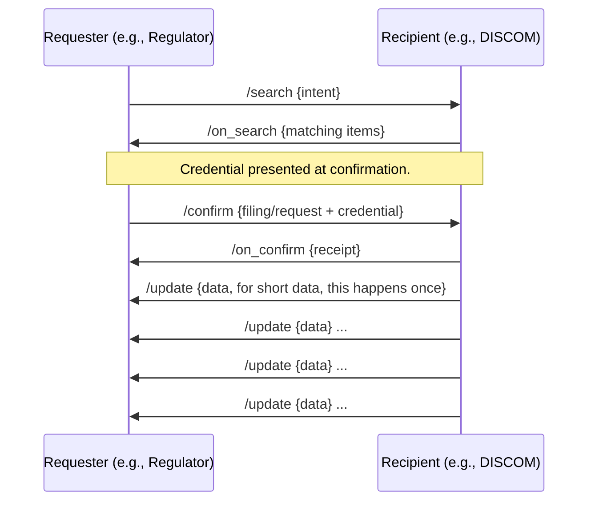

# IES Energy Data Exchange
**Unified Data Exchange Architecture and Specifications**
**India Energy Stack (IES)**

---

## Overview

| Field | Value |
|---|---|
| **Use Case Name** | Energy Data Exchange |
| **Category** | Data Exchange & Interoperability |
| **Outcome Theme** | Repeatable, verifiable, credential-gated data exchange across the energy ecosystem |
| **IES Role** | Specifications, schemas, credential profiles, interaction patterns, conformance (not an operational platform or data repository) |

---

## Problem

The Indian power sector generates vast quantities of data — regulatory filings, tariff policies, consumer records, DER asset information, market transactions, operational telemetry. Today this data moves through fragmented, bespoke channels:

1. **Regulatory & Policy processes** are fundamentally **document-oriented**, leading to version **ambiguity** and significant **difficulties in automation**. Tariff policies arrive as PDFs and are independently re-implemented across the sector, creating interpretation drift.
2. **Grid Observability is hindered** because **high-volume data** (telemetry, DER assets) cannot be easily shared with **Value Added Services (VAS)** to aid **observability and planning for grid optimization**. The **lack of data standards** prevents exchanging this data in a safe and reliable fashion.
3. **Measurement Integrity is missing**, specifically **authentic measurements** that cannot be disputed. Without cryptographically verifiable data, it is impossible to reliably establish the **divergence of actuals from plans**, undermining accountability.
4. **Customer data is lost in utilities**, trapped in institutional silos (CIS, MDMS, billing) with no portable, consent-governed mechanism to share it with consumers or authorized service providers.
5. **Research and planning data** is shared through ad-hoc bilateral arrangements with no standard discovery, access terms, or audit trails.

These are not five separate problems. They are one problem: the sector lacks a **unified data exchange specification** that differentiates public from private data, attaches trust proofs, and produces verifiable receipts — while keeping data at source.

---

## Energy Data Exchange in One Sentence

IES Energy Data Exchange defines a unified architecture for **public** (verifiable, open) and **private** (gated, consented) exchange — establishing the **data standards** and trust proofs required to transform fragmented telemetry into **trusted data** for **Value Added Services (VAS)**, grid optimization, and Policy as Code, all delivered through a single, repeatable specification.

---

## Architecture

The architecture defines core data structures and interaction patterns that can be used to build data exchange systems. It does not define a specific platform or service.  The common data structures allow for interoperability between different systems.  Data may be exchanged using different mechanisms such as verifiable credentials including data digests, tariff or other policy packages available over open directories, stream of realtime data exchange using open protocols like BECKN, MQTT or REST APIs + Webhooks.

The data exchange may happen over public directories or private inter party exchange.  Public directories allow for open data or catalogues to be posted by relevant authorities and consumed by anyone at any time without needing additional authorisation.  Private exchange requires participants to be authenticated and authorised to exchange data.  Public data could be used for data such as policy or tariff definitions, open data, or data that is required to be shared publicly by regulation.  Private data exchange may be used for data such as consumer data, grid data, or data that is required to be shared privately by regulation.



### Public Data Exchange

Public data is data containing no attributes with privacy or confidentiality implications — general-purpose datasets, regulatory aggregates, and data that is open by obligation or policy. It is discoverable by anyone, verifiable by anyone, hosted at source, and carries no access-gating or purpose-limiting controls. If a custodian requires access control or purpose constraints on a dataset, that dataset belongs in the private channel regardless of whether it contains consumer PII.



**What lives here:**
- Attested policy packs (executable tariff logic, test vectors, clause mappings)
- Public disclosure objects (derived from accepted regulatory filings, containing only permitted fields/aggregations)
- DER registry entries (public asset attributes, location, capacity)
- Participant directories (entity identity, endpoints, public keys, supported data types)
- Certified equipment lists, revocation registries, tariff schedules

**Upload mechanism:** Custodians upload their data to a self-maintained data store.  They register the data in DeDi with a URL pointing to the data store.  The DeDi entry includes the data's schema reference, hash, and license terms URL.  The DeDi entry is signed by the custodian establishing the root of trust.

**Access mechanism:** Access to the data is granted by the custodian to the data accessor based on the license terms URL.  The data accessor can then access the data from the custodian's data store.  In some scenarios, custodians may choose to make the directory entry public, but deploy access control on the data access.  Where the data is small, for example a tariff package, the data may be included in the directory entry itself.

**Discovery mechanism:** All public data is cacheable and accessible publicly.  To make the discovery of data easier - catalog files may be published by custodians in DeDi with URLs pointing to the catalog file.  This can be cached and indexed by any search and access mechanism such as web search or BECKN discovery.

**Trust model:** Content hashes over data objects, issuer digital signatures, public key lookup via directories. No central trust authority — verification is portable and deterministic.

**Data custodianship:** The entity with authority over the data hosts it and publishes its metadata to the directory. Policy publishers host policy packs. Regulators host public disclosure objects. DISCOMs host DER registry entries. Directory operators maintain the discovery index following IES directory specifications.

**Revocation and expiry:** Data objects may be revoked or expired by the custodian.  The revocation or expiry information is published to the directory.  The data accessor can then check the directory for revocation or expiry information before accessing the data.

### Private Data Exchange

Private data is access-controlled, consent-gated.  Private data may contain sensitive consumer data or sensitive business data — though it need not. A custodian may route any dataset through the private channel if they require access control or usage terms, even when the data contains no PII.  The access mechanism may be BECKN, REST APIs + webhooks, credential pull via credential wallets, MQTT or other mechanisms.  BECKN and credential wallets are the recommended access mechanisms, though alternative methods may be used as per need.  IES data standards are highly recommended to enable interoperability.  Discovery of private data exchange may be assisted via public data exchange mechanisms.


Above diagram shows streaming data exchange over BECKN network.  Data exchange as a credential is as a credential pull into a wallet.  REST APIs with webhooks or MQTT may also be used for data exchange where necessary.

Data exchange may be performed as a push as well, for example a DISCOM may push data to a regulator.




**What lives here:**
- Regulatory filings (DISCOM → regulator submissions with validation, attestation, receipts)
- Consumer-level data (meter data, billing, connection details — credential-issuance-first; API optional)
- Restricted disclosures (shared with authorised requesters under defined policy)
- Brokered datasets (research, planning — data stays at source, access terms codified, receipts generated)

**Transaction protocol:** BECKN transaction protocol, credential pull protocols like DigiLocker, REST APIs with webhooks or MQTT may also be used for data exchange where necessary.

**Access control:** Energy credentials (W3C Verifiable Credentials) gate every interaction. Institutional access is governed by role-based credentials with purpose constraints.

**Brokered exchange:** For data shared with third parties (researchers, policymakers, market analysts), IES follows DDM-aligned principles: data remains at source, contributor retains control, access terms are codified per accessor class, and every transaction produces a receipt.


### Data Standards

IES Data Exchange prioritizes interoperability by adopting and extending established international standards rather than defining bespoke formats. This ensures compatibility with global energy management systems and grid operational tools.

*   **OpenADR 3.0**: IES adopts or extends OpenADR 3.0 definitions for flexibility signals, demand-side management, and event-based communications where applicable.
*   **CIM Model**: For resource definitions, grid topology, and asset metadata, IES follows or extends the Common Information Model (IEC 61968/61970).

#### Data Classification

Data within the ecosystem is classified into three categories based on its frequency of change and delivery model:

1.  **Static Data**: Defined once or updated infrequently. This includes program registrations, resource definitions, participant metadata, and tariff policy frameworks.
2.  **Dynamic Data**: Information that changes frequently, typically exchanged as discrete events or continuous reports.
    *   **Events**: Time-bound signals, commands, or contracts. Examples include price signals, load limit commands for demand flexibility, and P2P contract commitments.
    *   **Reports**: Signals representing actual observed data, such as energy meter readings (actuals), voltages, and other telemetry.
3.  **Hybrid Data**: Data that combines relatively stable definitions with floating or periodically updated parameters (e.g., a resource with a fixed capacity but dynamic availability state).

#### Data Quality and Signal Attributes

To ensure trust and reliability, data objects may include additional attributes to signal:
*   **Data Quality**: Information regarding measurement accuracy, sensor health, or method of data acquisition (e.g., estimated vs. measured).
*   **Processing Requirements**: Specific flags or metadata required for regulatory compliance or automated processing.

#### Examples

##### Energy generation report including some ouutage

```json
{
  "objectType": "REPORT",
  "reportName": "Daily_Meter_with_DR_Impact",
  "eventID": "Afternoon_Peak_Shed",
  "clientName": "Resident_VEN_44",
  "resources": [
    {
      "resourceName": "SolarGeneration",
      "intervals": [
        { "id": 20, "intervalPeriod": { "start": "2026-03-24T10:00:00Z", "duration": "PT45M" }, 
          "payloads": [{ "type": "USAGE", "values": [0.0] }, { "type": "DATA_QUALITY", "values": ["MISSING"] }] },
        { "id": 28, "intervalPeriod": { "start": "2026-03-24T14:00:00Z", "duration": "PT30M" }, 
          "payloads": [{ "type": "USAGE", "values": [3.50] }] }
      ]
    },
    {
      "resourceName": "GridExport",
      "intervals": [
        { "id": 20, "intervalPeriod": { "start": "2026-03-24T10:00:00Z", "duration": "PT45M" }, 
          "payloads": [{ "type": "USAGE", "values": [0.0] }, { "type": "DATA_QUALITY", "values": ["MISSING"] }] },
        { "id": 28, "intervalPeriod": { "start": "2026-03-24T14:00:00Z", "duration": "PT30M" }, 
          "payloads": [{ "type": "USAGE", "values": [3.35] }] } 
      ]
    },
    {
      "resourceName": "GridImport",
      "intervals": [
        { "id": 20, "intervalPeriod": { "start": "2026-03-24T10:00:00Z", "duration": "PT45M" }, 
          "payloads": [{ "type": "USAGE", "values": [0.0] }, { "type": "DATA_QUALITY", "values": ["MISSING"] }] },
        { "id": 28, "intervalPeriod": { "start": "2026-03-24T14:00:00Z", "duration": "PT30M" }, 
          "payloads": [{ "type": "USAGE", "values": [0.0] }] }
      ]
    }
  ]
}
```

##### Self auditable energy report with a virtual aggregator and dyanmic pricing

```json
{
  "objectType": "REPORT",
  "reportName": "Aggregated_Audit_Telemetry",
  "eventID": "Peak_Price_Incentive_001",
  "clientName": "Virtual_Aggregator_01",
  "payloadDescriptors": [
    {
      "objectType": "REPORT_PAYLOAD_DESCRIPTOR",
      "payloadType": "USAGE",
      "readingType": "SUMMED",
      "units": "KWH"
    },
    {
      "objectType": "REPORT_PAYLOAD_DESCRIPTOR",
      "payloadType": "PRICE",
      "units": "KWH",
      "currency": "INR"
    }
  ],
  "resources": [
    {
      "resourceName": "AGGREGATED_REPORT",
      "intervals": [
        {
          "id": 28,
          "intervalPeriod": { "start": "2026-03-31T14:00:00Z", "duration": "PT1H" },
          "payloads": [
            { "type": "USAGE", "values": [22.50] },
            { "type": "PRICE", "values": [12.00] }
          ]
        }
      ]
    },
    {
      "resourceName": "METER_MASK_001",
      "intervals": [
        {
          "id": 28,
          "payloads": [
            { "type": "USAGE", "values": [1.10] },
            { "type": "PRICE", "values": [12.00] }
          ]
        }
      ]
    },
    {
      "resourceName": "METER_MASK_002",
      "intervals": [
        {
          "id": 28,
          "payloads": [
            { "type": "USAGE", "values": [0.65] },
            { "type": "PRICE", "values": [12.00] }
          ]
        }
      ]
    },
    {
      "resourceName": "METER_MASK_003",
      "intervals": [
        {
          "id": 28,
          "payloads": [
            { "type": "USAGE", "values": [0.90] },
            { "type": "PRICE", "values": [12.00] }
          ]
        }
      ]
    }
  ]
}
```
##### Example of telescopic tariff definition

```json
{
  "objectType": "PROGRAM",
  "programName": "Residential_Slab_Tariff",
  "attributes": [
    {
      "type": "TARIFF_STRUCTURE",
      "values": ["TELESCOPIC"]
    },
    {
      "type": "SLAB_DEFINITION",
      "values": [
        "0-100:4.50",
        "101-200:6.00",
        "201-plus:7.20"
      ]
    }
  ]
}
```

### Autorisation for private data exchange

Private data exchange requires explicit authorisation before exchange of data.  Various authorisation schemes may be used based on the business requirements:

* When exchanging data as a credential, for example when importing into DigiLocker, the credential pull and sharing shall follow the standard OIDC flows.  The credentials are signed by the issuer and can be verified by the verifier.
* When exchanging the data over a private network, such as a BECKN network - the exchanging parties shall be known based on the network onboarding and may exchange data based on the trust established during onboarding.
* When exchanging data over a public network, other authorisation mechanisms such as OAuth shall be used to establish trust.

Where necessary, the data is signed by the provider and provided under explicit and informed consent of the data owner.  Where aggregated data is necessary to be shared for grid management, the data shall be anonymised, aggregated, minimised or appropriately masked to protect the identity of the original data owner and the data shall be deemed to then be owned by the appropriate utility or grid operator.  The dyanmic data masking requirements and further data use or sharing shall be defined in the data sharing agreement.

Sensitive data shall be shared over secure networks or appropriately secure channels.  Utilities shall follow the principle of sharing data to known authorised recipient where possible rather than return to requestor model to ensure malicious actors cannot access sensitive data.

## Use case models

### Machine Readable Policy — Public Discovery Flow

Policy as code may be used to capture tariff policies including slab based billing, time of day tariffs, deviation penalties, or other complex tariff structures.  Code may also be used to set requirements on report frequency, data quality, or other data exchange parameters.  Policy may be published by regulators, utilities, or other entities.  Policy may be consumed by apps, agents, or other entities.  Policy may be published in public data exchange or provided dynamically during private data exchange.


### Disclosure — Public Access Flow

Disclosures are derived from accepted private filings and published to the public data exchange.  The derivation may require data aggregation or anonymisation to support dynamic data masking requirements.  It is strongly recommended to capture these policies as policy objects that are published to the public data exchange.

---

## Conformance

Implementations MUST pass:

1. **Envelope conformance** — correct packet structure, correlation ID handling, ACK/NACK semantics.
2. **Schema conformance** — valid JSON-LD objects for each payload profile.
3. **Credential conformance** — correct credential presentation, signature verification, revocation checking.
4. **Receipt conformance** — receipt generation with correct content hashes and timestamp binding.
5. **Data transport conformance** — `payloadHash` present and verifiable; `payloadUrl` authorization-enforced at the download endpoint.
6. **Test vector conformance** (for policy packs) — deterministic execution producing identical outputs for the same pack version and inputs.

A conformance kit (validator + test vectors + reference payloads) will be published as part of the IES specification release.

---

## What Energy Data Exchange Does NOT Do

- Define DISCOM internal systems (CIS/MDMS/ERP/billing pipelines)
- Mandate centralised storage, ledger, or data repository
- Replace regulator portals, MIS systems, or vendor platforms
- Define regulatory policy intent (only the machine-verifiable representation)
- Operate as a data marketplace platform (IES defines the rails; implementations are federated)
- Require API endpoints for consumer personal data (credential issuance to consumer is the default; API is optional)

---

## Open Schema Principle

IES defines schemas for its anchor use cases (regulatory filings, meter data, policy packs, disclosures, consumer credentials). Beyond these, **the ecosystem may define and publish additional schemas** without requiring IES approval. Any schema used in an IES-based integration MUST be **openly published** — closed or proprietary schemas are not permitted for integrations that other parties depend on. Ecosystem-contributed schemas should be registered in the IES schema registry or an equivalent discoverable location so that implementers can discover and reuse them. IES does not act as a gatekeeper; it acts as a floor.

### A proposed path to open schema

Key requirements:

1. **Evolvability** — schemas should be designed to evolve over time without breaking existing implementations
2. **Versioning** — schemas should be versioned to allow for backward compatibility
3. **Coexistence of multiple versions** — multiple versions of schemas maybe in use simultaniously
4. **Configurability** — for the same object type, different use cases may require different details to be shared.  Data needs to be minimised, aggregated or masked for security, privacy and efficiency reasons.
5. **Extensibility** — schemas should be extensible to allow for new features to be added
6. **Openness** — schemas should be openly published and available for use by any party


#### Extensible Attribute Patterns

IES adopts the extensible architecture proven in standards like OpenADR 3.0 and BECKN, focusing on well-defined object types (`PROGRAM`, `RESOURCE`, `EVENT`, `REPORT`) with a flexible metadata layer.

*   **Flexible Attribute Sets**: While each object has a defined base structure, the schema allows for an arbitrary set of attributes. This ensures core specification stability while allowing specific implementations to carry necessary domain data.
*   **Handling Unknown Attributes**: The specification defines a standard set of "must-understand" attributes. For attributes outside this set, clear rules are established for graceful handling — systems that do not recognise an attribute must preserve and pass it through, ensuring they do not break downstream automation.
*   **Layered Definitions**: This approach allows specific deployments to add additional definitions and rules without impacting the base protocol. For example, specific regulatory regimes (like California's Rule 21) can define mandatory attribute sets for their jurisdiction while remaining conformant to the global specification.
*   **BECKN Alignment**: BECKN tags follow a similar approach, providing a framework where additional attributes can be defined along with their usage rules.

This framework provides the necessary flexibility to support diverse sector requirements while maintaining a single, repeatable interaction grammar.

---
## Additional Resources

Technical details and specialized use cases are documented in the following standalone guides:

- [**P2P Trade Representation**](data_exchange_p2p_trade.md): Details on extending OpenADR for Peer-to-Peer energy trading and settlements.
- [**DER Visibility & High-Frequency DERMS**](data_exchange_der_visibility.md): Requirements for DER asset registries, telemetry, and high-frequency monitoring/control using Exception-Based Reporting.

*India Energy Stack — Ministry of Power | REC Limited (Programme Nodal Agency) | FSR Global (Knowledge Partner)*
---