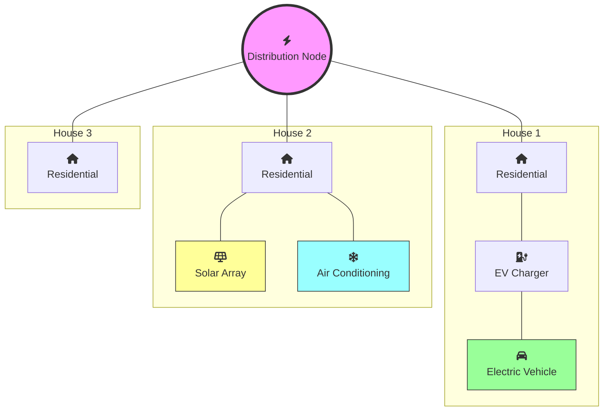

# DER Visibility Related Data Exchange

For DER visibility, three aspects are required:
1. Catalogue of DER assets
2. Telemetry data from resources related to energy and quality of operation
3. Aggregate reports for analysis and planning

All these can be realized as cases of data exchange. The first two uses need a private data exchange, while the third may sometimes use a public data exchange.

The list of DER assets and their details could be obtained via API endpoints.

Consistent with OpenADR 3.0, this could be via the following APIs:
* `GET /resources`: Returns a list of all resources with high-level details.
* `GET /resources/{resourceId}`: Returns details of a specific resource.
* `POST /resources/{resourceId}`: Updates details of a specific resource.
* `DELETE /resources/{resourceId}`: Deletes a specific resource.

Resource addition and deletion are performed by utilities. The GET APIs are available to all authorized users to support resource discovery and visibility.

### Federated Architecture
A power distribution network can be seen as a tree, with higher-level grids composed of lower-level grids leading to final connections via a hierarchy of stations, sub-stations, transformers, etc. Resource discovery follows a similar architecture for federating discovery across the ecosystem. When returning a list of resources via `GET /resources`, a `RESOURCE_TREE` may be returned with details of the tree provider, allowing for a composable and decentralized architecture. This approach enables both real asset registries and value-added services (defining virtual resources) to be easily observed.

### Tree Levels
The network tree can be visualized and addressed via levels originating from the root or from meter connections. DERs are typically positioned at level `+1` from meters, while other grid resources may be at `meter -1`, `-2`, etc. Access rights and observability may be restricted to specific level ranges within a tree or sub-tree.

### Data Security and Entitlements
Users see only the resources and details they are entitled to see. For example, some users may see only aggregated resources while others see individual components. This is enforced via access credentials, typically issued by tree root owners (e.g., GRIDINDIA) expressing access to a specific sub-tree.

Key security principles include:
* **Credential Federation**: Tree owners may accept credentials from parent trees (e.g., DISCOMs accepting GRIDINDIA-issued credentials) based on established trust rules. These rules may limit access to certain levels and enforce DII requirements for safety, while allowing for transparency and visibility to authorized users.
* **Access Constraints**: Credentials may limit access to a certain distance from the root or height from a leaf, or restrict visibility to specific tree levels.
* **Data Masking**: Access terms define what data is visible, including masking or other Data Identification Information (DII) requirements for privacy. Data visibility is explicitly allowed, not implicitly presumed.

The BECKN protocol could also be used to realize DER discovery.



#### Example: GET /resources

```json
[
  {
    "id": "res-h1-ev",
    "createdDateTime": "2026-03-31T10:00:00Z",
    "modificationDateTime": "2026-03-31T10:00:00Z",
    "objectType": "RESOURCE",
    "resourceName": "H1_EV_Charger",
    "venID": "ven-h1-res"
  },
  {
    "id": "res-h2-solar",
    "createdDateTime": "2026-03-31T10:05:00Z",
    "modificationDateTime": "2026-03-31T10:05:00Z",
    "objectType": "RESOURCE",
    "resourceName": "H2_Solar_Array",
    "venID": "ven-h2-res"
  },
  {
    "id": "res-h2-ac",
    "createdDateTime": "2026-03-31T10:07:00Z",
    "modificationDateTime": "2026-03-31T10:07:00Z",
    "objectType": "RESOURCE",
    "resourceName": "H2_AC_Unit",
    "venID": "ven-h2-res"
  }
]
```

#### Example: Federated Resource Discovery (India National Grid)

```json
[
  {
    "id": "grid-india-root",
    "createdDateTime": "2026-03-31T10:00:00Z",
    "modificationDateTime": "2026-03-31T10:00:00Z",
    "objectType": "RESOURCE",
    "resourceName": "India_National_Grid",
    "venID": "grid-india-01"
  },
  {
    "objectType": "RESOURCE_TREE",
    "treeName": "Northern_Regional_Grid",
    "treeUrl": "https://api.nrldc.in/ies/v1/resources",
    "owner": "NRLDC"
  },
  {
    "objectType": "RESOURCE_TREE",
    "treeName": "Southern_Regional_Grid",
    "treeUrl": "https://api.srldc.in/ies/v1/resources",
    "owner": "SRLDC"
  },
  {
    "objectType": "RESOURCE_TREE",
    "treeName": "Western_Regional_Grid",
    "treeUrl": "https://api.wrldc.in/ies/v1/resources",
    "owner": "WRLDC"
  },
  {
    "objectType": "RESOURCE_TREE",
    "treeName": "BESCOM_Distribution_Network",
    "treeUrl": "https://api.bescom.co.in/ies/v1/resources",
    "owner": "BESCOM"
  }
]
```

#### Example: GET /resources/{resourceId}

```json
{
  "id": "res-h2-solar",
  "createdDateTime": "2026-03-15T09:00:00Z",
  "modificationDateTime": "2026-03-15T09:10:00Z",
  "objectType": "RESOURCE",
  "resourceName": "H2_Solar_Array",
  "venID": "ven-h2-res",
  "attributes": [
    {
      "type": "LOCATION",
      "values": [12.9716, 77.5946]
    },
    {
      "type": "MAX_POWER_EXPORT",
      "values": [5.0]
    },
    {
      "type": "DESCRIPTION",
      "values": ["Residential PV Inverter with 1s telemetry capability"]
    }
  ]
}
```

Telemetry details can be viewed as energy data exchange reports under a subscription model. MQTT, REST API + Webhooks, or BECKN can be used for delivery. Aggregated reports over a defined period can be shared via file exchange (e.g., a utility publishing regional DER generation planning reports).

#### Example: Hybrid Telemetry Audit (Aggregation, Measurement, and Estimates)

```json
{
  "objectType": "REPORT",
  "reportName": "Hybrid_Telemetry_Audit",
  "clientName": "Virtual_Aggregator_01",
  "payloadDescriptors": [
    {
      "objectType": "REPORT_PAYLOAD_DESCRIPTOR",
      "payloadType": "USAGE",
      "readingType": "SUMMED",
      "units": "KWH"
    },
    {
      "objectType": "REPORT_PAYLOAD_DESCRIPTOR",
      "payloadType": "GENERATION",
      "readingType": "SUMMED",
      "units": "KWH"
    }
  ],
  "resources": [
    {
      "resourceName": "TOTAL_COMMUNITY_LOAD",
      "description": "Aggregated sum of 3 residential houses (H1, H2, H3)",
      "intervals": [
        {
          "id": 101,
          "intervalPeriod": { "start": "2026-04-01T14:00:00Z", "duration": "PT30M" },
          "payloads": [
            { "type": "USAGE", "values": [45.20] } 
          ]
        }
      ]
    },
    {
      "resourceName": "H1_EV_Charger",
      "description": "Actual real-time charging telemetry",
      "intervals": [
        {
          "id": 101,
          "payloads": [
            { "type": "USAGE", "values": [2.15] }
          ]
        }
      ]
    },
    {
      "resourceName": "H2_Solar_Array",
      "description": "Estimated solar export due to local sensor timeout",
      "intervals": [
        {
          "id": 101,
          "payloads": [
            { "type": "GENERATION", "values": [0.85] },
            { "type": "DATA_QUALITY", "values": ["ESTIMATED"] }
          ]
        }
      ]
    }
  ]
}
```

## Resource Details Requirements

### OpenADR 3.0 Standard Attributes
OpenADR allows arbitrary _Attributes_ to be defined for a _Resource_. The standard specifically defines the following core attributes:

| Attribute Type | Expected Values | Description |
| :--- | :--- | :--- |
| `LOCATION` | `[lat, lon]` | Geographic coordinates following ISO 6709. |
| `DESCRIPTION` | `["String"]` | Human-readable context for the resource. |
| `MAX_POWER_EXPORT` | `[number]` | Maximum kW the resource can inject into the grid. |
| `MAX_POWER_IMPORT` | `[number]` | Maximum kW the resource can draw from the grid. |
| `PHASE` | `["PHASE_A", etc]` | The electrical phase connection (e.g., Phase A, B, or C). |

### Regional Context (e.g., California CSIP / Rule 21)
The following attributes are often mandated or suggested to support advanced grid management at a macro level via OpenADR:

| Attribute Type | Status | Context | Description |
| :--- | :--- | :--- | :--- |
| `LOCATION` | Mandatory | GPS Coordinates | Enables geospatial visibility and feeder mapping. |
| `PHASE` | Mandatory | Connectivity | Vital for managing phase imbalance and local voltage. |
| `MAX_POWER_EXPORT` | Mandatory | Nameplate Capacity | Physical safety limit defined in Interconnection Agreements. |
| `FEEDER_ID` | Suggested | Grid Topology | Links the resource to utility CIM-based circuit models. |
| `TRANSFORMER_ID` | Suggested | Local Topology | Used for managing secondary-side thermal constraints. |
| `OPERATIONAL_STATE` | Mandatory | Monitoring | Indicates current connectivity (CONNECTED or DISCONNECTED). |
| `W_MAX_LIMIT` | Required | Control | Dynamic active power limit (Watts) for demand management. |
| `V_REF` | Required | Autonomous Functions | Nominal voltage reference used for Volt-Var curves. |
| `SMART_INVERTER_MODEL` | Suggested | Compliance | Identifies hardware support for Phase 1, 2, or 3 functions. |

> [!NOTE]
> `W_MAX_LIMIT` and `OPERATIONAL_STATE` are dynamic attributes that reflect the real-time status of the resource.

### Fine Grained Visibility and Control Requirements
IEEE 2030.5 allows for more fine-grained visibility and control of DERs. This is detailed below:

#### DERCapability (Hardware Limits)
IEEE 2030.5 expands upon basics like `MAX_POWER_EXPORT` to define the physical "envelope" of the inverter:
* `rtgMaxW` / `rtgMaxVA`: Nameplate active and apparent power ratings.
* `rtgMaxVar` / `rtgMaxVarNeg`: Max reactive power (absorbing and injecting).
* `rtgMinPF`: Minimum power factor capability.
* `rtgVNom`: Nominal voltage rating (critical for Rule 21 autonomous curves).
* `rtgMaxChargeRateW`: For storage, the maximum rate at which the battery can charge.

#### DERStatus (Real-time Health)
While OpenADR reports USAGE, IEEE 2030.5 provides detailed operational states:
* `inverterStatus`: Enumerations like CONNECTED, OFF, FAULT, or STARTING_UP.
* `genConnectStatus`: Connection state specifically for the generator/PV side.
* `localControlModeStatus`: Indicates if control is by the utility, local owner, or an autonomous curve.
* `alarmStatus`: A 32-bit bitmap flagging grid faults (e.g., OVER_VOLTAGE, VOLTAGE_IMBALANCE).

#### DERSettings (Active Configuration)
These represent the "active" ruleset the device is currently following:
* `setWMax`: The current active power limit (curtailment setpoint).
* `setGradW`: The default ramp rate for output changes.
* `setSoftStartGradW`: Ramp rate for reconnecting after a grid fault.
* `setVRef`: The active voltage setpoint for Volt-Var regulation.

---

# Appendix: Data Exchange Proposal for High-Frequency DERMS observation and control

DERMS (Distributed Energy Resource Management System) manages DER operation in a power grid, monitoring and controlling them in real-time to ensure grid stability and reliability.

To implement high-frequency monitoring (second granularity) while managing data load, IES utilizes Exception-Based Reporting ("Report by Exception"). In this model:
1. The resource pushes a Report only if voltage or power exceeds a pre-defined deadband.
2. The DERMS sends a Control Event only to correct an out-of-tolerance state.

## 1. Schema Extensions for Tolerance-Based Monitoring
We extend `payloadType` and attributes to define the "Tolerance" or "Deadband" rules.

### New Payload Types
* `VOLTAGE_MONITOR`: High-frequency voltage reading.
* `VOLTAGE_UPPER_LIMIT`: Threshold above which a control action is triggered.
* `VOLTAGE_LOWER_LIMIT`: Threshold below which a control action is triggered.

### New Attributes
* `REPORT_DEADBAND`: Percentage change required to trigger a new report (e.g., 0.5%).
* `SAMPLING_RATE`: High-frequency setting (e.g., 1S).

## 2. High-Frequency Control Event (DERMS to Inverter)
Defines the "Safe Zone." If voltage stays within limits (e.g., 235V–245V), the inverter follows its local curve. If limits are hit, DERMS sends a `DISPATCH_SETPOINT` to curtail generation immediately.

```json
{
  "objectType": "EVENT",
  "programID": "prog-derms-fast-2026",
  "eventName": "Voltage_Regulation_Fast_Control",
  "priority": 0,
  "payloadDescriptors": [
    { "objectType": "EVENT_PAYLOAD_DESCRIPTOR", "payloadType": "VOLTAGE_UPPER_LIMIT", "units": "VOLTS" },
    { "objectType": "EVENT_PAYLOAD_DESCRIPTOR", "payloadType": "DISPATCH_SETPOINT", "units": "KW" }
  ],
  "attributes": [
    { "type": "REPORT_DEADBAND", "values": [0.5] },
    { "type": "SAMPLING_RATE", "values": ["1S"] }
  ],
  "intervals": [
    {
      "id": 500,
      "intervalPeriod": { "start": "2026-03-31T15:40:00Z", "duration": "PT5M" },
      "payloads": [
        { "type": "VOLTAGE_UPPER_LIMIT", "values": [245.0] },
        { "type": "DISPATCH_SETPOINT", "values": [0.0] }
      ]
    }
  ]
}
```

## 3. Exception-Based Report (Inverter to DERMS)
Avoids sending 3,600 readings per hour. The inverter only reports when a violation occurs.

```json
{
  "objectType": "REPORT",
  "reportName": "Voltage_Violation_Telemetry",
  "eventID": "Voltage_Regulation_Fast_Control",
  "payloadDescriptors": [
    { "objectType": "REPORT_PAYLOAD_DESCRIPTOR", "payloadType": "VOLTAGE_MONITOR", "units": "VOLTS" },
    { "objectType": "REPORT_PAYLOAD_DESCRIPTOR", "payloadType": "USAGE", "units": "KWH" }
  ],
  "resources": [
    {
      "resourceName": "INVERTER_MASK_01",
      "intervals": [
        {
          "id": 8821,
          "intervalPeriod": { "start": "2026-03-31T15:42:05.123Z", "duration": "PT1S" },
          "payloads": [
            { "type": "VOLTAGE_MONITOR", "values": [246.2] },
            { "type": "DATA_QUALITY", "values": ["BAD"] }
          ]
        }
      ]
    }
  ]
}
```
