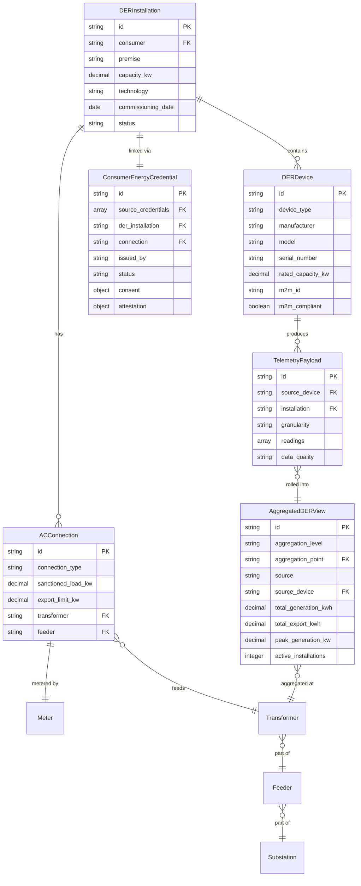
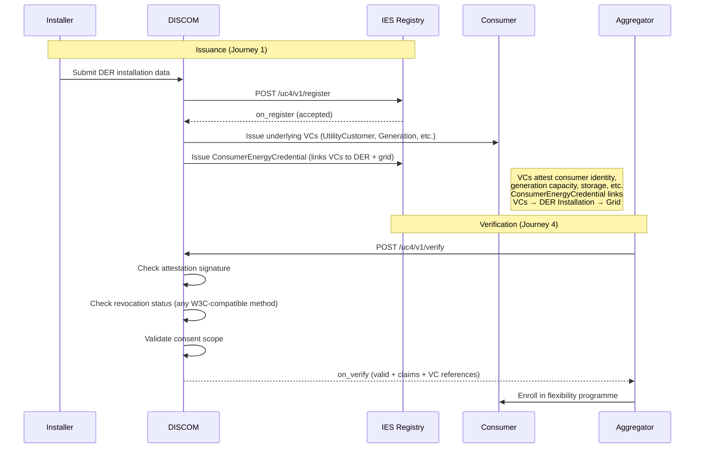
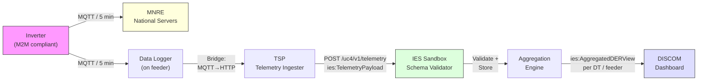
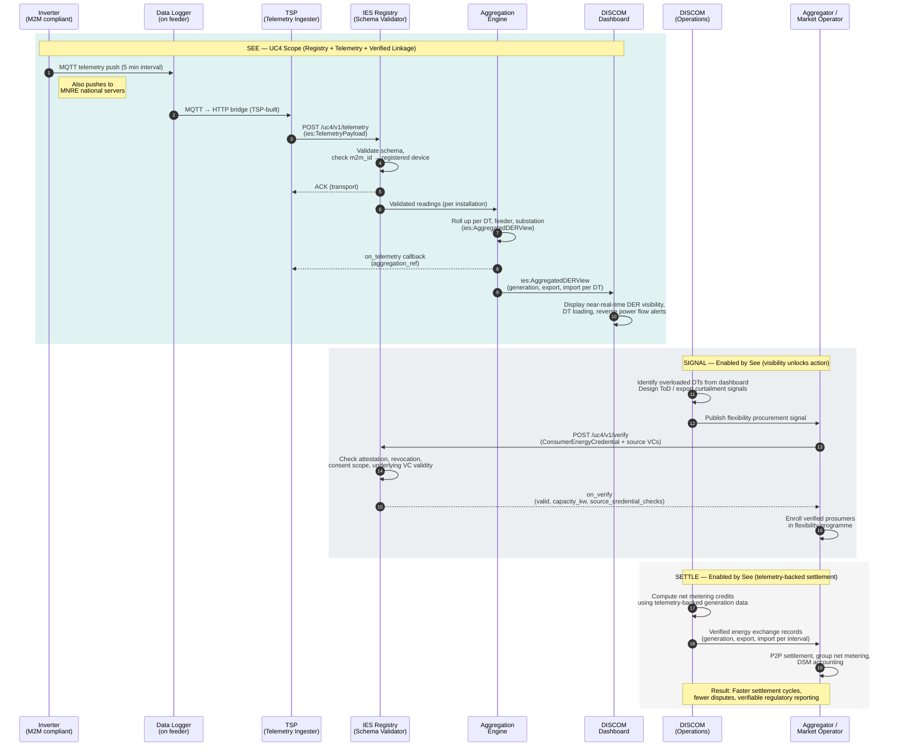

# DER Visibility
**Standardised DER Registry, Telemetry Ingestion & Verified Asset-to-Grid Linkage**
**India Energy Stack (IES)**

---

## Overview

| Field | Value |
|---|---|
| **Use Case Name** | DER Visibility |
| **Category** | Grid Operations & Planning |
| **Outcome Theme** | Real-time DER generation visibility, verified asset-to-grid linkage, and distribution-level operational intelligence |
| **IES Role** | Standards, specs, reference profiles, conformance (not an operational platform) |

---

## Problem

DISCOMs need reliable, near-real-time visibility of distributed energy resources (DERs) to protect distribution transformers, improve scheduling accuracy, meet flexibility mandates, and verify energy exchanges. Today, this visibility does not exist at the distribution level:

1. **No generation visibility below 20 kW**
   90%+ of PM Surya Ghar installations have no dedicated generation meter. The inverter produces energy, but no system captures it at the point of generation. DISCOMs see only the net effect at the billing meter — and often not even that in real time.

2. **Behind-the-meter consumption is invisible**
   Self-consumption, EV charging loads, and battery cycling happen behind the meter. DISCOMs cannot distinguish generation from load, making demand forecasting and transformer loading estimates unreliable.

3. **No aggregate DER impact per transformer or feeder**
   97% of India's 14.8 million distribution transformers have no communicating meter. Even where individual DER data exists, there is no mechanism to aggregate generation, export, and import per DT or feeder for operational use.

4. **No standard for DISCOMs to consume M2M data at distribution level**
   MNRE's inverter M2M mandate routes data to national servers, but no DISCOM-level consumption standard exists. DISCOMs cannot programmatically access, validate, or act on this data for their own operational needs.

### What DISCOMs HAVE vs What DISCOMs DO NOT HAVE

| DISCOMs HAVE | DISCOMs DO NOT HAVE |
|---|---|
| Billing meter reads (monthly/bi-monthly) | Real-time or near-real-time generation data per installation |
| Consumer records in CIS / billing systems | Verified linkage from consumer → premise → connection → meter → DER asset |
| Solar portal registrations (partial, inconsistent) | Standardised DER registry with device-level detail |
| Knowledge that DERs exist on their network | Aggregate DER generation/export/import per transformer or feeder |
| MNRE M2M mandate (data goes to national servers) | Standard API to consume inverter M2M data at the DISCOM level |
| Net meter reads (where installed) | Decomposition of net reading into generation, self-consumption, and export |
| DT asset records (mostly non-communicating) | Real-time DT loading data that includes DER contribution |
| Scheduling obligation to SLDC | Accurate DER generation forecasts to support schedule preparation |

### The MNRE M2M Mandate: Existing Data, Missing Access

The Ministry of New and Renewable Energy (MNRE) mandates that all new grid-connected solar inverters above a threshold must have M2M (machine-to-machine) communication capability and report operational data — generation, voltage, frequency, power factor — to MNRE's central servers. This means:

- **The data already exists.** Inverters across PM Surya Ghar installations are already producing telemetry data.
- **The data already flows.** M2M-compliant inverters are already transmitting to MNRE national servers.
- **DISCOMs cannot access it.** There is no standard API, no DISCOM-level ingestion point, and no format specification for DISCOMs to consume this data for their own operational needs.

This guide bridges this gap. It does not replace the MNRE M2M mandate or its national-level data collection. Instead, IES DER Visibility defines:
1. **A standard DISCOM-level telemetry ingestion API** — so DISCOMs can receive and validate the same inverter M2M data
2. **A canonical telemetry schema** (`ies:TelemetryPayload`) — so the data arrives in a consistent, machine-verifiable format regardless of inverter manufacturer or M2M protocol
3. **An aggregation layer** — so individual inverter data is rolled up per transformer, feeder, and substation for operational use
4. **A verified linkage** — connecting each M2M data stream to a specific consumer, premise, connection, and DER installation via the registry and Consumer Energy Credential

The MNRE M2M mandate provides the **data source**. IES provides the **DISCOM-level consumption standard**.

---

## In One Sentence

This use case establishes a **standardised DER registry, telemetry ingestion pipeline, and verified asset-to-grid linkage** so DISCOMs can see what distributed energy resources are producing or consuming — per transformer, per feeder, near-real-time — using inverter M2M data as the generation data source where no dedicated meter exists.

---

## Core Concept: Registry Entry as the Unit of Truth

A **DER Registry Entry** is the canonical representation of a distributed energy resource installation and its relationship to the grid. It follows a three-level hierarchy (modeled after AEMO's DER Register):



**Why inverter M2M data as the generation source:**
Where no dedicated generation meter exists (90%+ of rooftop solar below 20 kW), the inverter's own telemetry — generation, export, voltage, power factor — is the only available near-real-time data source. Thanks to the MNRE M2M mandate, this data is already being produced by compliant inverters across PM Surya Ghar installations. This use case treats inverter M2M data as the generation proxy, validated against billing-cycle net meter reads where available. The M2M data stream from each inverter is linked to the DER registry via the device's `m2m_id` (the MNRE-assigned M2M identifier), closing the loop from data source to registered asset.

### Consumer Energy Credential Lifecycle



**Relationship to DISCOM-Issued Verifiable Credentials:**

DISCOMs issue individual W3C Verifiable Credentials (VCs) to consumers — UtilityCustomerCredential, ConsumptionProfileCredential, GenerationProfileCredential, StorageProfileCredential, and UtilityProgramEnrollmentCredential. These VCs are consumer-facing identity claims issued and revoked by the DISCOM using any W3C VC-compliant issuance service.

The `ies:ConsumerEnergyCredential` is not a replacement for these VCs. It is a **linkage record** maintained in the DER registry that:
1. References the underlying VCs by their identifiers
2. Connects them to a specific DER installation and grid connection point
3. Adds IES-level consent and attestation for programme participation

This separation ensures that the VC layer (consumer-facing, DISCOM-issued, W3C-standard) and the registry layer (grid-facing, IES-native, operational) remain independently deployable.

**Single Source of Truth:**
The **attested Registry Entry** + **Consumer Energy Credential (with VC references)** + **telemetry linkage** — not a centralized database. Each utility maintains its own system of record. Interoperability is achieved through canonical schemas, standard APIs, and audit-ready receipts.

---

## See → Signal → Settle

The value chain follows three stages. Each stage requires the one before it:

| Stage | What it means | What it enables |
|---|---|---|
| **See** | Actual generation and EV load, near-real-time, per DT/feeder. MNRE-mandated inverter M2M data as the primary source, ingested via standardised IES telemetry APIs. Verified asset-to-grid linkage via registry + credentials. | Operational awareness: which DTs are overloaded, where is reverse power flow occurring, what is the actual DER contribution per feeder. |
| **Signal** | Enabled by visibility. DISCOMs design load management programs, ToD signals, export curtailment signals, flexibility procurement signals. | Demand response, DER participation in flexibility markets, proactive DT protection, better scheduling accuracy. |
| **Settle** | Enabled by visibility. Energy exchanges measured and verified within the month. Net metering credits, group net metering, peer-to-peer settlement, DSM accounting. | Faster settlement cycles, fewer disputes, regulatory reporting with verifiable data. |

**IES focuses on the "See" layer** — the registry, telemetry ingestion, and verified linkage that make Signal and Settle possible. DER Visibility data feeds into schedule preparation and settlement, but the schedule exchange protocol itself is defined separately.

### Telemetry Data Flow (MNRE M2M → DISCOM → Dashboard)





---

## Before IES vs After IES (Value Delivered)

| Registry / Exchange Step / Pain Point | Before IES | After IES (with IES) | Where IES Specifically Adds Value |
|---|---|---|---|
| DER registry format | DISCOM-specific portals and spreadsheets; inconsistent fields | Canonical DER registry payloads | Canonical schemas + standard APIs |
| Generation visibility | No data below 20 kW; monthly billing meter only | Near-real-time inverter M2M ingestion per installation | Telemetry ingestion pipeline + validation |
| Behind-the-meter decomposition | Net meter only; no generation/self-consumption split | Generation, export, import, self-consumption from inverter data | Telemetry payload schema + aggregation |
| DT/feeder aggregate view | No communicating DT meters; no aggregation | Aggregated DER impact per DT, feeder, substation | Aggregation primitives + standard queries |
| Identifier fragmentation | No persistent IDs across systems; duplicates common | Unique persistent IDs for installations/devices | Identifier standards + registry primitives |
| Consumer-to-DER linkage | Weak/partial linkage; non-portable verification | Verifiable Consumer → Premise → Connection → Meter → DER linkage via VC references | Energy Credentials (VC layer) + ConsumerEnergyCredential (linkage layer) + consent + audit trail |
| M2M data consumption | MNRE M2M mandate routes inverter data to national servers; DISCOMs have no API to consume this data | Standard DISCOM-level telemetry ingestion API leveraging MNRE M2M data streams | Telemetry endpoints + canonical schema + validation gate |
| Schedule preparation | No real-time DER data for schedule inputs; manual estimation | Accurate near-real-time DER generation data improves schedule quality | Visibility layer feeds better data into schedule preparation (exchange protocol defined separately) |
| Validation and data quality | Errors found late; missing fields hard to detect | Validation at ingestion with structured error codes | Validation gate + conformance rules |
| Audit and disputes | Hard to prove what was submitted/used and when | Receipts with hashes, versions, timestamps | Tamper-evident receipts + audit linkage |
| Regulatory submissions | Ad-hoc templates; low comparability | Standardised, versioned reporting schemas | Reporting schemas + attestation |

---

## IES Contribution

- **Canonical DER registry schemas:** Installation → AC Connection → Device hierarchy with standard fields
- **Telemetry ingestion pipeline:** Standard schema for MNRE-mandated inverter M2M data ingestion at the DISCOM level, with validation and aggregation
- **Consumer Energy Credentials:** VC-backed linkage from Consumer → Premise → Connection → Meter → DER Asset, with consent and audit trail
- **Aggregation primitives:** Per-transformer, per-feeder, per-substation DER generation/export/import summaries
- **Regulatory reporting schemas** with versioning and attestation
- **Conformance kit:** Validator, test vectors, certification checklist

## Outside IES Scope

- DISCOM internal solar portals and installation workflows
- Real-time operational telemetry and control systems (SCADA, dispatch, AGC)
- DSM calculations and dispute resolution
- Inverter firmware, installer certification programs
- SLDC operational decisions and dispatch algorithms
- Specific inverter hardware mandates or M2M protocol selection
- Replacing DISCOM solar portals or MNRE national M2M servers
- **M2M source adapters:** the bridge from MNRE's MQTT-based M2M data streams (or inverter cloud APIs) to the IES HTTP POST telemetry API is a TSP-built integration, not an IES specification. IES defines the canonical *output* format; source-side adapters are implementation-specific.
- **VC issuance infrastructure:** the choice of W3C VC issuance service, DID method, and revocation registry platform is a DISCOM implementation decision, not an IES specification. IES defines conformance requirements for interoperability, not vendor selection.

---

## Stakeholders

| Stakeholder | Role | What they get | Impact |
|---|---|---|---|
| **DISCOMs** | Publish DER installation + linkage data; ingest telemetry; issue VCs | Standardised exchange, real-time DER visibility, reduced reporting burden | Faster settlement, DT protection, cleaner data |
| **System Operators (SLDC/RLDC)** | Consume aggregated DER views; coordinate settlement | Aggregated DER visibility and registry data | Better planning, accurate scheduling, faster settlement |
| **Consumers/Prosumers** | Provide consent; hold portable W3C VCs | Portability and program participation | Easier participation, portability |
| **Aggregators** | Verify credentials and DER capacity; manage portfolios | Reduced verification burden; scale onboarding | Lower cost, faster scaling |
| **Technology Partners (TSPs)** | Build adapters, dashboards, telemetry ingesters | Standard schemas, conformance clarity, reduced bespoke work | Faster integration, reusable components |
| **Regulators (SERC/CERC)** | Receive standardised, versioned submissions | Improved oversight and comparability | Better regulatory oversight |

---

## Key Outcomes

- **Primary:** Real-time DER generation visibility per transformer and feeder — protecting DTs from overloading and enabling accurate demand forecasting
- **Secondary:** Verified asset-to-grid linkage (Consumer → Premise → Connection → Meter → DER) enabling faster settlement, accurate scheduling, and reduced reconciliation burden
- **Tertiary:** Complete, comparable DER datasets for regulatory reporting, flexibility mandate compliance, and programme/market enablement

### Mapped to DISCOM Priorities

| Outcome | DISCOM Priority |
|---|---|
| Per-DT generation/export visibility | **Protect DTs** — identify overloaded transformers before failure |
| Accurate DER generation data for scheduling | **Improve scheduling** — reduce DSM penalties via better forecasts |
| Verified DER capacity and generation data | **Meet flexibility mandates** — participate in flexibility markets with credible data |
| Telemetry-backed energy exchange records | **Verify exchanges** — settle net metering, group net metering, and peer-to-peer within the month |

---

## Architecture Diagrams

### Actors and Connections


### Sequence Flow


---

## Exchange Pattern

All interactions follow an **asynchronous request / ACK / callback** pattern:

1. The initiating party sends a request message and receives an **immediate ACK** (transport-level confirmation of receipt).
2. The responding party processes the request and delivers the **business response** asynchronously via a callback.
3. Every request carries a `transaction_id` and `message_id` for correlation. The callback echoes the same `transaction_id`.

This pattern is transport-agnostic. The reference implementation uses HTTP POST endpoints.

### Standard Message Envelope

Every message uses the standard IES outer wrapper:

```json
{
  "ies_version": "1.0",
  "context": {
    "domain":         "energy.der",
    "action":         "<action-name>",
    "country":        "IND",
    "jurisdiction":   "<IES jurisdiction code, e.g. IN.MH>",
    "timestamp":      "<ISO 8601>",
    "transaction_id": "<globally unique>",
    "message_id":     "<unique per message>",
    "requester_id":   "<IES actor ID of initiating party>",
    "provider_id":    "<IES actor ID of responding party>",
    "ttl":            "<ISO 8601 duration, e.g. PT30S>"
  },
  "message": {
    "< one of the UC4 primitives below >"
  }
}
```

### Immediate ACK/NACK

Every inbound message MUST be acknowledged synchronously before processing begins:

```json
{
  "context": {
    "transaction_id": "<echoed>",
    "message_id":     "<echoed>"
  },
  "message": {
    "ack": { "status": "ACK" }
  }
}
```

On format or routing failure, replace `"ACK"` with `"NACK"` and include an `"error"` object:

```json
{
  "message": {
    "ack":   { "status": "NACK" },
    "error": { "code": "ERR_INVALID_SCHEMA", "message": "Missing required field: capacity_kw" }
  }
}
```

### Error Codes

| Code | Action(s) | Meaning |
|---|---|---|
| `ERR_INVALID_SCHEMA` | Any | Payload does not conform to the expected JSON schema |
| `ERR_DEVICE_NOT_FOUND` | `telemetry` | `source_device` m2m_id does not match any registered device |
| `ERR_INSTALLATION_NOT_FOUND` | `telemetry`, `verify` | Referenced installation does not exist in the registry |
| `ERR_INSTALLATION_SUSPENDED` | `telemetry`, `verify` | Installation status is `suspended` or `decommissioned` |
| `ERR_CREDENTIAL_REVOKED` | `verify` | Credential status is `revoked` or `suspended` |
| `ERR_VC_VERIFICATION_FAILED` | `verify` | One or more referenced VCs failed cryptographic or revocation checks |
| `ERR_TIMESTAMP_OUT_OF_RANGE` | `telemetry` | Reading timestamps fall outside the declared `period` |
| `ERR_DUPLICATE_SUBMISSION` | `register`, `telemetry` | A payload with the same `@id` has already been accepted |
| `ERR_UNAUTHORIZED` | Any | Requester is not authorized for this action on this resource |

### Actions

| Action | Callback | Intent |
|---|---|---|
| `register` | `on_register` | Submit a DER installation for registry entry creation |
| `update` | `on_update` | Update DER details, status, or device information |
| `telemetry` | `on_telemetry` | Submit inverter M2M telemetry data (`ies:TelemetryPayload`) or pre-aggregated DER views (`ies:AggregatedDERView`) from data loggers |
| `search` | `on_search` | Discover registered DERs, query telemetry, or fetch aggregated views |
| `verify` | `on_verify` | Verify a Consumer Energy Credential (attestation, revocation status, consent scope, and underlying VC validity) |
| `report` | `on_report` | Submit regulatory reports with DER data |

---

## IES Vocabulary (`@context`)

This use case uses a compact IES-native JSON-LD vocabulary hosted at `https://ies.gov.in/vocab/uc4/v1`. Implementations may reference it by URL or inline it.

> **Naming convention:** Field names use `snake_case` throughout (matching the telemetry and registry domain). All vocabulary terms match the field names used in the primitive schemas exactly. DISCOM-issued W3C VCs use `camelCase` per their own JSON-LD contexts. The VC field mapping section below provides the canonical equivalences.

> **`from` / `to` typing:** These fields are typed as `xsd:date` in the vocabulary. When a primitive requires dateTime precision (e.g., telemetry periods), the schema specifies `dateTime (ISO 8601)` and implementations should treat the value accordingly. The vocabulary type is the default; schema-level overrides take precedence.

```json
{
  "@context": {
    "ies":    "https://ies.gov.in/vocab#",
    "xsd":    "http://www.w3.org/2001/XMLSchema#",

    "consumer":           { "@id": "ies:consumer",           "@type": "@id" },
    "premise":            { "@id": "ies:premise",            "@type": "@id" },
    "installation":       { "@id": "ies:installation",       "@type": "@id" },
    "device":             { "@id": "ies:device",             "@type": "@id" },
    "acConnection":       { "@id": "ies:acConnection",       "@type": "@id" },
    "meter":              { "@id": "ies:meter",              "@type": "@id" },
    "transformer":        { "@id": "ies:transformer",        "@type": "@id" },
    "feeder":             { "@id": "ies:feeder",             "@type": "@id" },
    "substation":         { "@id": "ies:substation",         "@type": "@id" },

    "capacity_kw":        { "@id": "ies:capacity_kw",        "@type": "xsd:decimal" },
    "technology":         "ies:technology",
    "device_type":        "ies:device_type",
    "manufacturer":       "ies:manufacturer",
    "model":              "ies:model",
    "serial_number":      "ies:serial_number",
    "firmware_version":   "ies:firmware_version",
    "m2m_id":             "ies:m2m_id",
    "m2m_compliant":      { "@id": "ies:m2m_compliant",      "@type": "xsd:boolean" },
    "registered_by":      { "@id": "ies:registered_by",      "@type": "@id" },
    "registered_at":      { "@id": "ies:registered_at",      "@type": "xsd:dateTime" },

    "inverter":           { "@id": "ies:inverter",           "@type": "@id" },
    "telemetry":          { "@id": "ies:telemetry",          "@type": "@id" },
    "generation_kwh":     { "@id": "ies:generation_kwh",     "@type": "xsd:decimal" },
    "export_kwh":         { "@id": "ies:export_kwh",         "@type": "xsd:decimal" },
    "import_kwh":         { "@id": "ies:import_kwh",         "@type": "xsd:decimal" },
    "self_consumption_kwh":{"@id": "ies:self_consumption_kwh","@type": "xsd:decimal" },
    "voltage_v":          { "@id": "ies:voltage_v",          "@type": "xsd:decimal" },
    "power_factor":       { "@id": "ies:power_factor",       "@type": "xsd:decimal" },
    "data_quality":       "ies:data_quality",
    "granularity":        "ies:granularity",

    "source":             "ies:source",
    "source_device":      { "@id": "ies:source_device",      "@type": "@id" },
    "source_credentials": { "@id": "ies:source_credentials", "@container": "@set" },

    "aggregation_level":  "ies:aggregation_level",
    "aggregation_point":  { "@id": "ies:aggregation_point",  "@type": "@id" },

    "attestation":        "ies:attestation",
    "attestedBy":         { "@id": "ies:attestedBy",         "@type": "@id" },
    "consent":            "ies:consent",
    "integrity":          "ies:integrity",
    "payloadHash":        "ies:payloadHash",

    "period":             "ies:period",
    "from":               { "@id": "ies:from",               "@type": "xsd:date" },
    "to":                 { "@id": "ies:to",                 "@type": "xsd:date" },
    "status":             "ies:status"
  }
}
```

### VC Field Mapping
<!-- EDIT 3: VC type mapping added -->

Registry primitives use `snake_case`. DISCOM-issued W3C VCs use `camelCase`. The following table provides the canonical field equivalences for cross-referencing between the two layers. Implementations performing cross-validation (e.g., confirming that a VC's stated capacity matches the registry entry) use this mapping.

| Registry Field (snake_case) | W3C VC Field (camelCase) | VC Type(s) | Notes |
|---|---|---|---|
| `capacity_kw` | `capacityKW` | GenerationProfileCredential | Installed DC capacity |
| `consumer` (actor ID) | `consumerNumber` | All VCs | IES uses actor URN; VCs use DISCOM consumer number. Cross-ref via registry lookup. |
| `connection_type` | `connectionType` | ConsumptionProfileCredential | `single_phase` ↔ `Single-phase`; normalize on ingest |
| `sanctioned_load_kw` | `sanctionedLoadKW` | ConsumptionProfileCredential | Same semantics, different casing |
| `meter` (meter_id) | `meterNumber` | UtilityCustomerCredential, GenerationProfileCredential, StorageProfileCredential | Primary cross-reference key |
| `manufacturer` | `manufacturer` | GenerationProfileCredential | Identical |
| `model` | `modelNumber` | GenerationProfileCredential | `model` (registry) ↔ `modelNumber` (VC) |
| `rated_capacity_kw` | `capacityKW` | GenerationProfileCredential | Same value, different field name |
| `storageCapacityKWh` (not in registry) | `storageCapacityKWh` | StorageProfileCredential | Carried in VC only; registry has `rated_capacity_kw` on the DERDevice |
| `powerRatingKW` (not in registry) | `powerRatingKW` | StorageProfileCredential | Carried in VC only |
| N/A | `premisesType` | ConsumptionProfileCredential | VC-only field; not replicated in registry |
| N/A | `tariffCategoryCode` | ConsumptionProfileCredential | VC-only field; not replicated in registry |
| N/A | `programName`, `programCode` | UtilityProgramEnrollmentCredential | VC-only field; not tracked in registry |

> **Design principle:** Fields that describe the consumer's identity, tariff, and programme participation live in the VCs. Fields that describe the physical grid topology (DT, feeder, substation) and device telemetry linkage live in the DER registry. The `ies:ConsumerEnergyCredential` bridges the two by referencing VC identifiers and associating them with a registry entry.

---

## Primitives

Each primitive is a JSON-LD typed object that appears inside `message` in the standard envelope. Schemas are shown first; examples follow each schema.

---

### 1. `ies:DERInstallation`

**Purpose:** the top-level registration object representing a complete DER installation at a consumer premise.

#### Schema

```json
{
  "@context":           "object | string (vocab URL)",
  "@id":                "string — stable URN, e.g. urn:ies:uc4:installation:{id}",
  "@type":              "ies:DERInstallation",
  "consumer":           "string — IES actor ID of the consumer/prosumer",
  "premise":            "string — premise identifier (address + geolocation)",
  "capacity_kw":        "number — total installed DC capacity in kW",
  "technology":         "string — solar_rooftop | solar_ground | wind | battery | ev_charger | hybrid",
  "commissioning_date": "date (ISO 8601)",
  "location": {
    "lat":              "number — latitude (WGS84)",
    "lng":              "number — longitude (WGS84)",
    "address":          "string — human-readable address",
    "district":         "string",
    "state":            "string"
  },
  "ac_connections": [
    "ies:ACConnection — see primitive 2"
  ],
  "devices": [
    "ies:DERDevice — see primitive 3"
  ],
  "status":             "string — registered | active | suspended | decommissioned",
  "registered_by":      "string — IES actor ID of the registering entity (DISCOM/installer)",
  "registered_at":      "dateTime (ISO 8601)"
}
```

#### Example

```json
{
  "@context":           "https://ies.gov.in/vocab/uc4/v1",
  "@id":                "urn:ies:uc4:installation:MSEDCL-PMSG-2026-00142",
  "@type":              "ies:DERInstallation",
  "consumer":           "urn:ies:actor:consumer:MH-PUNE-4410012345",
  "premise":            "urn:ies:premise:MH-PUNE-411038-PLOT-42",
  "capacity_kw":        3.0,
  "technology":         "solar_rooftop",
  "commissioning_date": "2025-11-15",
  "location": {
    "lat":              18.5204,
    "lng":              73.8567,
    "address":          "42 Shivaji Nagar, Pune",
    "district":         "Pune",
    "state":            "Maharashtra"
  },
  "ac_connections": [
    {
      "@id":            "urn:ies:uc4:ac:MSEDCL-PMSG-2026-00142-AC1",
      "@type":          "ies:ACConnection"
    }
  ],
  "devices": [
    {
      "@id":            "urn:ies:uc4:device:MSEDCL-PMSG-2026-00142-INV1",
      "@type":          "ies:DERDevice"
    }
  ],
  "status":             "active",
  "registered_by":      "urn:ies:actor:DISCOM-MSEDCL",
  "registered_at":      "2025-11-20T10:30:00Z"
}
```

---

### 2. `ies:ACConnection`

**Purpose:** the grid connection point linking the DER installation to the distribution network.

#### Schema

```json
{
  "@context":           "object | string (vocab URL)",
  "@id":                "string — stable URN, e.g. urn:ies:uc4:ac:{id}",
  "@type":              "ies:ACConnection",
  "connection_type":    "string — single_phase | three_phase",
  "sanctioned_load_kw": "number — sanctioned load in kW",
  "export_limit_kw":    "number — maximum export allowed in kW",
  "import_limit_kw":    "number — maximum import allowed in kW",
  "meter": {
    "meter_id":         "string — meter serial number or unique identifier",
    "meter_type":       "string — net | bidirectional | smart | conventional",
    "communication":    "string — rf_mesh | gprs | nb_iot | none"
  },
  "transformer":        "string — DT identifier (urn:ies:uc4:dt:{id})",
  "feeder":             "string — feeder identifier",
  "substation":         "string — substation identifier"
}
```

#### Example

```json
{
  "@context":           "https://ies.gov.in/vocab/uc4/v1",
  "@id":                "urn:ies:uc4:ac:MSEDCL-PMSG-2026-00142-AC1",
  "@type":              "ies:ACConnection",
  "connection_type":    "single_phase",
  "sanctioned_load_kw": 5.0,
  "export_limit_kw":    3.0,
  "import_limit_kw":    5.0,
  "meter": {
    "meter_id":         "MH-NET-2025-887432",
    "meter_type":       "net",
    "communication":    "none"
  },
  "transformer":        "urn:ies:uc4:dt:MSEDCL-DT-PUNE-SHIVAJI-0042",
  "feeder":             "urn:ies:uc4:feeder:MSEDCL-FDR-PUNE-SHIVAJI-11KV-03",
  "substation":         "urn:ies:uc4:ss:MSEDCL-SS-PUNE-SHIVAJI-33KV"
}
```

---

### 3. `ies:DERDevice`

**Purpose:** an individual device (inverter, battery, EV charger) within a DER installation. For inverters, the `m2m_id` links the device to the MNRE M2M mandate data stream, enabling telemetry correlation.

#### Schema

```json
{
  "@context":           "object | string (vocab URL)",
  "@id":                "string — stable URN, e.g. urn:ies:uc4:device:{id}",
  "@type":              "ies:DERDevice",
  "device_type":        "string — inverter | battery | ev_charger | micro_inverter",
  "manufacturer":       "string — manufacturer name",
  "model":              "string — model identifier",
  "serial_number":      "string — device serial number",
  "rated_capacity_kw":  "number — rated capacity in kW",
  "firmware_version":   "string — current firmware version",
  "m2m_id":             "string — MNRE-assigned M2M communication identifier; links device to MNRE M2M data stream",
  "m2m_compliant":      "boolean — whether the device meets MNRE M2M communication mandate requirements"
}
```

#### Example

```json
{
  "@context":           "https://ies.gov.in/vocab/uc4/v1",
  "@id":                "urn:ies:uc4:device:MSEDCL-PMSG-2026-00142-INV1",
  "@type":              "ies:DERDevice",
  "device_type":        "inverter",
  "manufacturer":       "Growatt",
  "model":              "MIN 3000TL-X",
  "serial_number":      "GRT2025MH00887432",
  "rated_capacity_kw":  3.0,
  "firmware_version":   "v2.1.4",
  "m2m_id":             "MNRE-M2M-MH-2025-887432",
  "m2m_compliant":      true
}
```

---

### 4. `ies:TelemetryPayload`

**Purpose:** a submission of inverter M2M telemetry data for a DER installation over a defined period. This is the canonical format for ingesting MNRE-mandated M2M data at the DISCOM level — regardless of inverter manufacturer, communication protocol (RF mesh, GPRS, NB-IoT), or M2M aggregator.

> **Measured vs derived fields:** `generation_kwh`, `export_kwh`, `voltage_v`, and `power_factor` are **measured** by the inverter or meter. `self_consumption_kwh` is a **derived** field, computed as `generation_kwh - export_kwh` for a given interval. `import_kwh` may come from the net meter (measured) or be derived if only inverter data is available. The `data_quality` field on each reading indicates the provenance. See [Derivation Rules](#derivation-rules-for-telemetry-fields) below.

#### Schema

```json
{
  "@context":           "object | string (vocab URL)",
  "@id":                "string — stable URN, e.g. urn:ies:uc4:telemetry:{id}",
  "@type":              "ies:TelemetryPayload",
  "source_device":      "string — @id of the ies:DERDevice producing the data",
  "installation":       "string — @id of the ies:DERInstallation",
  "period": {
    "from":             "dateTime (ISO 8601)",
    "to":               "dateTime (ISO 8601)"
  },
  "granularity":        "string — 15min | hourly | daily",
  "readings": [
    {
      "timestamp":              "dateTime (ISO 8601)",
      "generation_kwh":         "number — inverter AC output in the interval (measured)",
      "export_kwh":             "number — energy exported to grid (measured or derived)",
      "import_kwh":             "number — energy imported from grid (measured or derived)",
      "self_consumption_kwh":   "number — energy consumed on-site (DERIVED: generation_kwh - export_kwh)",
      "voltage_v":              "number — average voltage in V (measured)",
      "power_factor":           "number — average power factor (measured)",
      "data_quality":           "string — measured | derived | estimated | gap_filled"
    }
  ],
  "integrity": {
    "algorithm":        "string — hash algorithm, e.g. sha256",
    "payloadHash":      "string — hex digest over canonical readings array"
  }
}
```

#### Derivation Rules for Telemetry Fields

| Field | Source | Derivation |
|---|---|---|
| `generation_kwh` | Inverter M2M | **Measured** — inverter-reported AC output for the interval |
| `export_kwh` | Net meter or inverter | **Measured** if bidirectional meter available; otherwise derived from inverter data where net meter reads confirm over billing cycle |
| `import_kwh` | Net meter | **Measured** if bidirectional meter available; otherwise unavailable from inverter-only data |
| `self_consumption_kwh` | Computed | **Derived** — always `generation_kwh - export_kwh`. This formula holds for solar-only installations. For installations with battery storage, `self_consumption_kwh = generation_kwh - export_kwh - battery_charge_from_solar_kwh` — but without sub-metering the battery, the simple formula is the best available approximation. |
| `voltage_v` | Inverter M2M | **Measured** — inverter-reported AC voltage |
| `power_factor` | Inverter M2M | **Measured** — inverter-reported power factor |

> **Battery storage caveat:** When a battery is present, battery charging from solar reduces export but is not household consumption. Battery discharging to loads reduces import but is not solar generation. Without separate battery metering, the simple `generation - export` formula overestimates self-consumption during battery charge periods. Implementations should flag readings from installations with battery storage as `data_quality: "estimated"`.

#### Example

```json
{
  "@context":           "https://ies.gov.in/vocab/uc4/v1",
  "@id":                "urn:ies:uc4:telemetry:MSEDCL-TEL-2026-03-01-00142",
  "@type":              "ies:TelemetryPayload",
  "source_device":      "urn:ies:uc4:device:MSEDCL-PMSG-2026-00142-INV1",
  "installation":       "urn:ies:uc4:installation:MSEDCL-PMSG-2026-00142",
  "period": {
    "from":             "2026-03-01T00:00:00+05:30",
    "to":               "2026-03-01T23:59:59+05:30"
  },
  "granularity":        "15min",
  "readings": [
    {
      "timestamp":              "2026-03-01T06:00:00+05:30",
      "generation_kwh":         0.02,
      "export_kwh":             0.00,
      "import_kwh":             0.15,
      "self_consumption_kwh":   0.02,
      "voltage_v":              232.4,
      "power_factor":           0.98,
      "data_quality":           "measured"
    },
    {
      "timestamp":              "2026-03-01T12:00:00+05:30",
      "generation_kwh":         0.68,
      "export_kwh":             0.41,
      "import_kwh":             0.00,
      "self_consumption_kwh":   0.27,
      "voltage_v":              238.1,
      "power_factor":           0.99,
      "data_quality":           "measured"
    },
    {
      "timestamp":              "2026-03-01T18:00:00+05:30",
      "generation_kwh":         0.05,
      "export_kwh":             0.00,
      "import_kwh":             0.42,
      "self_consumption_kwh":   0.05,
      "voltage_v":              228.7,
      "power_factor":           0.96,
      "data_quality":           "measured"
    }
  ],
  "integrity": {
    "algorithm":        "sha256",
    "payloadHash":      "a1b2c3d4e5f6..."
  }
}
```

---

<!-- EDIT 1: ConsumerEnergyCredential redesigned as linkage record referencing VCs -->

### 5. `ies:ConsumerEnergyCredential`

**Purpose:** a linkage record that bridges DISCOM-issued W3C Verifiable Credentials to a specific DER installation and grid connection point. It does not duplicate the claims carried in the underlying VCs (consumer identity, generation capacity, storage attributes, etc.). Instead, it references those VCs by identifier and adds the IES-level consent, attestation, and grid-topology binding that the VCs do not carry.

> **Relationship to W3C VCs:** DISCOMs issue individual VCs to consumers — UtilityCustomerCredential, ConsumptionProfileCredential, GenerationProfileCredential, StorageProfileCredential, and UtilityProgramEnrollmentCredential. These are consumer-held, W3C-standard credentials. The `ies:ConsumerEnergyCredential` is a registry-side object that says: "these VCs, taken together, describe the consumer and assets at this DER installation, connected to the grid at this point."

#### Schema

```json
{
  "@context":           "object | string (vocab URL)",
  "@id":                "string — stable URN, e.g. urn:ies:uc4:credential:{id}",
  "@type":              "ies:ConsumerEnergyCredential",
  "source_credentials": [
    {
      "vc_id":          "string — identifier of the DISCOM-issued W3C VC (urn:uuid:...)",
      "vc_type":        "string — UtilityCustomerCredential | ConsumptionProfileCredential | GenerationProfileCredential | StorageProfileCredential | UtilityProgramEnrollmentCredential",
      "issuer":         "string — DID or URL of the issuing DISCOM",
      "issued_at":      "dateTime (ISO 8601)"
    }
  ],
  "der_installation":   "string — @id of the ies:DERInstallation",
  "connection":         "string — @id of the ies:ACConnection",
  "issued_by":          "string — IES actor ID of the issuing authority (DISCOM)",
  "issued_at":          "dateTime (ISO 8601)",
  "consent": {
    "purpose":          "string — purpose of credential issuance",
    "granted_at":       "dateTime (ISO 8601)",
    "expires_at":       "dateTime (ISO 8601)",
    "dpdp_compliant":   "boolean — DPDP Act 2023 compliance flag"
  },
  "status":             "string — active | suspended | revoked",
  "attestation": {
    "attestedBy":       "string — IES actor ID of the signing authority",
    "timestamp":        "dateTime (ISO 8601)",
    "algorithm":        "string — e.g. Ed25519, ECDSA",
    "signature":        "string — base64-encoded signature",
    "keyRef":           "string — URL of the public key"
  }
}
```

#### Example

```json
{
  "@context":           "https://ies.gov.in/vocab/uc4/v1",
  "@id":                "urn:ies:uc4:credential:MSEDCL-CEC-2026-00142",
  "@type":              "ies:ConsumerEnergyCredential",
  "source_credentials": [
    {
      "vc_id":          "urn:uuid:a1b2c3d4-5678-90ab-cdef-123456789012",
      "vc_type":        "UtilityCustomerCredential",
      "issuer":         "did:web:msedcl.maharashtra.gov.in",
      "issued_at":      "2025-11-18T09:00:00Z"
    },
    {
      "vc_id":          "urn:uuid:c3d4e5f6-7890-12ab-cdef-345678901234",
      "vc_type":        "GenerationProfileCredential",
      "issuer":         "did:web:msedcl.maharashtra.gov.in",
      "issued_at":      "2025-11-20T10:30:00Z"
    }
  ],
  "der_installation":   "urn:ies:uc4:installation:MSEDCL-PMSG-2026-00142",
  "connection":         "urn:ies:uc4:ac:MSEDCL-PMSG-2026-00142-AC1",
  "issued_by":          "urn:ies:actor:DISCOM-MSEDCL",
  "issued_at":          "2025-11-20T11:00:00Z",
  "consent": {
    "purpose":          "DER registration, telemetry access, and programme participation",
    "granted_at":       "2025-11-20T10:00:00Z",
    "expires_at":       "2027-11-20T10:00:00Z",
    "dpdp_compliant":   true
  },
  "status":             "active",
  "attestation": {
    "attestedBy":       "urn:ies:actor:DISCOM-MSEDCL-GM-IT",
    "timestamp":        "2025-11-20T11:00:00Z",
    "algorithm":        "Ed25519",
    "signature":        "base64:QrSt5678...",
    "keyRef":           "https://msedcl.gov.in/.well-known/ies-keys/gm-it.pub"
  }
}
```

> **Adding VCs over time:** When a consumer adds battery storage after initial solar registration, the DISCOM issues a new StorageProfileCredential. The `ies:ConsumerEnergyCredential` is updated (via the `update` action) to add the new VC reference to `source_credentials`. The registry entry and grid linkage remain unchanged.

> **Revocation:** A credential's `status` can be changed to `suspended` or `revoked` via the `update` action (with `@type: "ies:ConsumerEnergyCredential"` in the message). If an underlying VC is revoked by the DISCOM, the ConsumerEnergyCredential should also be updated. Verifiers check both the ConsumerEnergyCredential status and the underlying VC status during verification (see Journey 4). The full revocation model — including revocation lists, push notifications to relying parties, and revocation reason codes — is a post-pilot design concern.

---

### Schedule Integration

> DER Visibility data (telemetry + aggregation) feeds into DISCOM schedule preparation for SLDC. The schedule exchange protocol itself — including day-ahead submissions, revisions, counter-schedules, and reconciliation — is defined separately. DER Visibility's contribution to scheduling is providing accurate, near-real-time DER generation data that improves forecast quality.

---

### 6. `ies:AggregatedDERView`

**Purpose:** an aggregated summary of DER telemetry at a specific point in the distribution network (transformer, feeder, or substation).

#### Schema

```json
{
  "@context":           "object | string (vocab URL)",
  "@id":                "string — stable URN, e.g. urn:ies:uc4:aggview:{id}",
  "@type":              "ies:AggregatedDERView",
  "aggregation_level":  "string — transformer | feeder | substation",
  "aggregation_point":  "string — @id of the DT, feeder, or substation",
  "source":             "string — device_submitted | engine_computed",
  "source_device":      "string (optional) — @id of the logger/aggregator device, when source is device_submitted",
  "period": {
    "from":             "dateTime (ISO 8601)",
    "to":               "dateTime (ISO 8601)"
  },
  "granularity":        "string — 15min | hourly | daily",
  "summary": {
    "total_capacity_kw":       "number — sum of installed DER capacity",
    "active_installations":    "integer — count of active DER installations",
    "total_generation_kwh":    "number — total generation in the period",
    "total_export_kwh":        "number — total export to grid in the period",
    "total_import_kwh":        "number — total import from grid in the period",
    "total_self_consumption_kwh": "number — total self-consumption in the period",
    "peak_generation_kw":      "number — peak instantaneous generation observed"
  },
  "generated_at":       "dateTime (ISO 8601)"
}
```

#### Example

```json
{
  "@context":           "https://ies.gov.in/vocab/uc4/v1",
  "@id":                "urn:ies:uc4:aggview:MSEDCL-DT-PUNE-SHIVAJI-0042-2026-03-01",
  "@type":              "ies:AggregatedDERView",
  "aggregation_level":  "transformer",
  "aggregation_point":  "urn:ies:uc4:dt:MSEDCL-DT-PUNE-SHIVAJI-0042",
  "source":             "engine_computed",
  "period": {
    "from":             "2026-03-01T00:00:00+05:30",
    "to":               "2026-03-01T23:59:59+05:30"
  },
  "granularity":        "daily",
  "summary": {
    "total_capacity_kw":       42.0,
    "active_installations":    14,
    "total_generation_kwh":    168.5,
    "total_export_kwh":        72.3,
    "total_import_kwh":        412.8,
    "total_self_consumption_kwh": 96.2,
    "peak_generation_kw":      38.7
  },
  "generated_at":       "2026-03-02T00:15:00+05:30"
}
```

> When a data logger at a distribution transformer submits pre-aggregated readings, `source` is `"device_submitted"` and `source_device` references the logger's device ID. The `telemetry` action accepts both `ies:TelemetryPayload` (per-device) and `ies:AggregatedDERView` (pre-aggregated) submissions.

---

## End-to-End Interaction Examples

Four journeys illustrating the full DER Visibility flow:

---

### Journey 1 — DER Registration & Credential Creation

**Scenario:** An installer submits a new PM Surya Ghar 3 kW rooftop solar installation in Pune for registration. The DISCOM has already issued the consumer's W3C VCs (UtilityCustomerCredential and GenerationProfileCredential).

#### Step 1: Installer submits registration (`register`)

```json
{
  "ies_version": "1.0",
  "context": {
    "domain":         "energy.der",
    "action":         "register",
    "country":        "IND",
    "jurisdiction":   "IN.MH",
    "timestamp":      "2025-11-20T10:30:00Z",
    "transaction_id": "TXN-UC4-2025-11-20-0001",
    "message_id":     "MSG-UC4-2025-11-20-0001",
    "requester_id":   "urn:ies:actor:DISCOM-MSEDCL",
    "provider_id":    "urn:ies:actor:IES-SANDBOX",
    "ttl":            "PT30S"
  },
  "message": {
    "@context":           "https://ies.gov.in/vocab/uc4/v1",
    "@id":                "urn:ies:uc4:installation:MSEDCL-PMSG-2026-00142",
    "@type":              "ies:DERInstallation",
    "consumer":           "urn:ies:actor:consumer:MH-PUNE-4410012345",
    "premise":            "urn:ies:premise:MH-PUNE-411038-PLOT-42",
    "capacity_kw":        3.0,
    "technology":         "solar_rooftop",
    "commissioning_date": "2025-11-15",
    "location": {
      "lat": 18.5204, "lng": 73.8567,
      "address": "42 Shivaji Nagar, Pune",
      "district": "Pune", "state": "Maharashtra"
    },
    "ac_connections": [{
      "@id":   "urn:ies:uc4:ac:MSEDCL-PMSG-2026-00142-AC1",
      "@type": "ies:ACConnection",
      "connection_type": "single_phase",
      "sanctioned_load_kw": 5.0,
      "export_limit_kw": 3.0,
      "meter": { "meter_id": "MH-NET-2025-887432", "meter_type": "net" },
      "transformer": "urn:ies:uc4:dt:MSEDCL-DT-PUNE-SHIVAJI-0042",
      "feeder": "urn:ies:uc4:feeder:MSEDCL-FDR-PUNE-SHIVAJI-11KV-03"
    }],
    "devices": [{
      "@id":   "urn:ies:uc4:device:MSEDCL-PMSG-2026-00142-INV1",
      "@type": "ies:DERDevice",
      "device_type": "inverter",
      "manufacturer": "Growatt",
      "model": "MIN 3000TL-X",
      "serial_number": "GRT2025MH00887432",
      "rated_capacity_kw": 3.0,
      "m2m_id": "MNRE-M2M-MH-2025-887432",
      "m2m_compliant": true
    }],
    "status": "registered"
  }
}
```

**Immediate ACK:**

```json
{
  "context":  { "transaction_id": "TXN-UC4-2025-11-20-0001", "message_id": "MSG-UC4-2025-11-20-0001" },
  "message":  { "ack": { "status": "ACK" } }
}
```

#### Step 2: Registry validates and confirms (`on_register`)

```json
{
  "ies_version": "1.0",
  "context": {
    "domain":         "energy.der",
    "action":         "on_register",
    "transaction_id": "TXN-UC4-2025-11-20-0001",
    "message_id":     "MSG-UC4-2025-11-20-0002"
  },
  "message": {
    "registration_status": "accepted",
    "installation":        "urn:ies:uc4:installation:MSEDCL-PMSG-2026-00142",
    "credential_issued":   "urn:ies:uc4:credential:MSEDCL-CEC-2026-00142",
    "source_credentials_linked": [
      "urn:uuid:a1b2c3d4-5678-90ab-cdef-123456789012",
      "urn:uuid:c3d4e5f6-7890-12ab-cdef-345678901234"
    ],
    "notes":               "Consumer Energy Credential issued with 2 VC references. Installation active."
  }
}
```

---

### Journey 2 — Telemetry Ingestion & Aggregation

**Scenario:** Inverter M2M data for the registered installation is submitted for a single day, then aggregated at the transformer level.

#### Step 1: Telemetry submission (`telemetry`)

> The readings array below is abbreviated. A full day at 15-minute granularity would contain 96 entries.

```json
{
  "ies_version": "1.0",
  "context": {
    "domain":         "energy.der",
    "action":         "telemetry",
    "country":        "IND",
    "jurisdiction":   "IN.MH",
    "timestamp":      "2026-03-02T00:15:00+05:30",
    "transaction_id": "TXN-UC4-2026-03-02-TEL-0001",
    "message_id":     "MSG-UC4-2026-03-02-TEL-0001",
    "requester_id":   "urn:ies:actor:DISCOM-MSEDCL",
    "provider_id":    "urn:ies:actor:IES-SANDBOX",
    "ttl":            "PT30S"
  },
  "message": {
    "@context":       "https://ies.gov.in/vocab/uc4/v1",
    "@id":            "urn:ies:uc4:telemetry:MSEDCL-TEL-2026-03-01-00142",
    "@type":          "ies:TelemetryPayload",
    "source_device":  "urn:ies:uc4:device:MSEDCL-PMSG-2026-00142-INV1",
    "installation":   "urn:ies:uc4:installation:MSEDCL-PMSG-2026-00142",
    "period":         { "from": "2026-03-01T00:00:00+05:30", "to": "2026-03-01T23:59:59+05:30" },
    "granularity":    "15min",
    "readings": [
      { "timestamp": "2026-03-01T06:00:00+05:30", "generation_kwh": 0.02, "export_kwh": 0.00, "import_kwh": 0.15, "self_consumption_kwh": 0.02, "voltage_v": 232.4, "power_factor": 0.98, "data_quality": "measured" },
      { "timestamp": "2026-03-01T12:00:00+05:30", "generation_kwh": 0.68, "export_kwh": 0.41, "import_kwh": 0.00, "self_consumption_kwh": 0.27, "voltage_v": 238.1, "power_factor": 0.99, "data_quality": "measured" },
      { "timestamp": "2026-03-01T18:00:00+05:30", "generation_kwh": 0.05, "export_kwh": 0.00, "import_kwh": 0.42, "self_consumption_kwh": 0.05, "voltage_v": 228.7, "power_factor": 0.96, "data_quality": "measured" }
    ],
    "integrity": { "algorithm": "sha256", "payloadHash": "a1b2c3d4e5f6..." }
  }
}
```

**Immediate ACK** — transport accepted.

#### Step 2: Aggregated view generated (`on_telemetry` callback includes aggregation pointer)

```json
{
  "ies_version": "1.0",
  "context": {
    "domain":         "energy.der",
    "action":         "on_telemetry",
    "transaction_id": "TXN-UC4-2026-03-02-TEL-0001",
    "message_id":     "MSG-UC4-2026-03-02-TEL-0002"
  },
  "message": {
    "telemetry_status":  "accepted",
    "readings_ingested": 96,
    "validation":        "pass",
    "aggregation_ref":   "urn:ies:uc4:aggview:MSEDCL-DT-PUNE-SHIVAJI-0042-2026-03-01"
  }
}
```

### Journey 3 — Credential Verification (Aggregator Enrollment)

**Scenario:** An aggregator wants to enroll a prosumer's 3 kW rooftop solar installation into a flexibility programme. Before enrollment, the aggregator verifies the Consumer Energy Credential to confirm the consumer-to-DER linkage is valid and the underlying VCs are authentic.

#### Step 1: Aggregator requests credential verification (`verify`)

The aggregator sends a verification request to the DISCOM for the credential associated with the prosumer's installation:

```json
{
  "ies_version": "1.0",
  "context": {
    "domain":         "energy.der",
    "action":         "verify",
    "country":        "IND",
    "jurisdiction":   "IN.MH",
    "timestamp":      "2026-03-03T09:00:00+05:30",
    "transaction_id": "TXN-UC4-2026-03-03-VER-0001",
    "message_id":     "MSG-UC4-2026-03-03-VER-0001",
    "requester_id":   "urn:ies:actor:AGGREGATOR-FLEXCO",
    "provider_id":    "urn:ies:actor:DISCOM-MSEDCL",
    "ttl":            "PT30S"
  },
  "message": {
    "credential":   "urn:ies:uc4:credential:MSEDCL-CEC-2026-00142",
    "installation": "urn:ies:uc4:installation:MSEDCL-PMSG-2026-00142"
  }
}
```

#### Step 2: DISCOM responds with verification result (`on_verify`)

```json
{
  "ies_version": "1.0",
  "context": {
    "domain":         "energy.der",
    "action":         "on_verify",
    "transaction_id": "TXN-UC4-2026-03-03-VER-0001",
    "message_id":     "MSG-UC4-2026-03-03-VER-0002"
  },
  "message": {
    "verification": {
      "credential":          "urn:ies:uc4:credential:MSEDCL-CEC-2026-00142",
      "status":              "valid",
      "installation":        "urn:ies:uc4:installation:MSEDCL-PMSG-2026-00142",
      "capacity_kw":         3.0,
      "technology":          "solar_rooftop",
      "connection_status":   "active",
      "issuer":              "urn:ies:actor:DISCOM-MSEDCL",
      "issued_at":           "2025-11-20T11:00:00Z",
      "consent_valid_until": "2027-11-20T10:00:00Z",
      "attestation_verified": true,
      "source_credential_checks": [
        {
          "vc_id":     "urn:uuid:a1b2c3d4-5678-90ab-cdef-123456789012",
          "vc_type":   "UtilityCustomerCredential",
          "proof":     "valid",
          "revoked":   false,
          "expired":   false,
          "method":    "StatusList2021"
        },
        {
          "vc_id":     "urn:uuid:c3d4e5f6-7890-12ab-cdef-345678901234",
          "vc_type":   "GenerationProfileCredential",
          "proof":     "valid",
          "revoked":   false,
          "expired":   false,
          "method":    "StatusList2021"
        }
      ],
      "notes":               "Credential valid. All source VCs verified. Installation active. Consumer consent covers programme participation."
    }
  }
}
```

The aggregator can now enroll the prosumer with confidence that: (a) the DER installation exists and is active, (b) the consumer-to-asset linkage is attested by the DISCOM, (c) the underlying VCs (identity and generation capacity) are cryptographically valid and not revoked, (d) consent covers programme participation, and (e) the ConsumerEnergyCredential has not been revoked.

---

## HTTP API Surface

The interaction pattern maps to HTTP endpoints as follows. These are **illustrative reference paths**; implementations may vary.

### Well-known discovery

| Method | Path | Purpose |
|---|---|---|
| `GET` | `/.well-known/ies/uc4` | Returns endpoint URLs, supported registration types, schema versions, and telemetry capabilities |

### Registration endpoints

| Method | Path | Action |
|---|---|---|
| `POST` | `/uc4/v1/register` | `register` — submit DER installation for registry |
| `POST` | `/uc4/v1/update`   | `update` — update DER details or status |
| `POST` | `/uc4/v1/search`   | `search` — discover registered DERs or query data |

### Telemetry endpoints

| Method | Path | Action |
|---|---|---|
| `POST` | `/uc4/v1/telemetry`           | `telemetry` — submit inverter M2M telemetry data |
| `POST` | `/uc4/v1/telemetry/aggregate` | `search` (with aggregation filter) — query aggregated DER views |

### Credential verification endpoints

| Method | Path | Action |
|---|---|---|
| `POST` | `/uc4/v1/verify` | `verify` — verify a Consumer Energy Credential (attestation, revocation status, consent scope, and underlying VC validity) |

### Report endpoints

| Method | Path | Action |
|---|---|---|
| `POST` | `/uc4/v1/report` | `report` — submit regulatory reports with DER data |

### Callback endpoints

| Method | Path | Callback |
|---|---|---|
| `POST` | `/uc4/v1/on_register`  | `on_register` |
| `POST` | `/uc4/v1/on_update`    | `on_update` |
| `POST` | `/uc4/v1/on_telemetry` | `on_telemetry` |
| `POST` | `/uc4/v1/on_search`    | `on_search` |
| `POST` | `/uc4/v1/on_verify`    | `on_verify` |
| `POST` | `/uc4/v1/on_report`    | `on_report` |

Both sides expose both sets of endpoints. The initiating party's callback URL is declared in its IES actor registration.

---

## Pilot — Actors, Roles, and What to Build

### Pilot Scope

The pilot demonstrates DER registration, telemetry ingestion, and aggregated visibility for one DISCOM, 1–2 feeders, with 25–30 data loggers providing live inverter M2M data.

One DISCOM. One or two feeders. 25–30 loggers. Live dashboard. That is the success criterion.

---

### Actors, Roles, and Actions

| IES Actor Type | Pilot Participant | Role | Actions performed |
|---|---|---|---|
| **Network Utility** | DISCOM (pilot DISCOM) | `RegistryPublisher` + `TelemetryConsumer` — publishes DER registry data, ingests telemetry, issues VCs | `register`, `telemetry`, `search`, `verify` |
| **Technology Service Provider** | TSP (from EOI) | `SystemImplementer` — builds adapter, dashboard, and telemetry pipeline | Implements all submission and callback endpoints; integrates with DISCOM MDMS/systems |
| **Authority** | SLDC (observer role in pilot) | `AggregationConsumer` — consumes aggregated DER views | `search` (query aggregated views) |
| **Authority** | Regulator / SERC (observer role in pilot) | `Oversight` — monitors reporting quality and comparability | `on_report` (receive), `search` (query DER registry data) |

---

### What Each Participant Needs to Build

#### DISCOM + TSP (DISCOM side)

| Module | Description |
|---|---|
| **Data Adapter** | Reads DER installation data from DISCOM systems (solar portal, CIS, MDMS). Maps to `ies:DERInstallation` + `ies:ACConnection` + `ies:DERDevice` schemas. Handles consumer-to-DT linkage. |
| **Registry Publisher** | POSTs DER registration payloads to `/uc4/v1/register`. Handles ACK. Processes `on_register` callbacks. Stores registry confirmations and issued credentials. |
| **VC Issuance Integration** | Issues W3C VCs (UtilityCustomer, Generation, Storage, Consumption, ProgramEnrollment) using the DISCOM's chosen VC issuance service. Links issued VC identifiers to the ConsumerEnergyCredential. |
| **Telemetry Ingester** | Receives MNRE-mandated inverter M2M data (from data loggers, MNRE M2M feeds, or inverter cloud APIs). Normalizes manufacturer-specific formats into `ies:TelemetryPayload` canonical schema. Correlates each data stream to a registered device via `m2m_id`. POSTs to `/uc4/v1/telemetry`. Handles validation responses. |
| **Dashboard** | Displays aggregated DER generation/export/import per DT and feeder. Visualizes near-real-time data from `ies:AggregatedDERView` responses. Shows DT loading and reverse power flow alerts. |
| **Callback Listener** | Exposes `/uc4/v1/on_register`, `/uc4/v1/on_telemetry`, `/uc4/v1/on_verify` endpoints to receive asynchronous responses. |

#### IES Sandbox (provided by the programme team)

| Capability | What it provides |
|---|---|
| **Actor Registry** | Canonical IES actor IDs for all pilot participants. Public key directory for signature verification. |
| **Schema Validator** | Validates inbound DER registration and telemetry payloads against IES JSON schemas. Returns structured error codes on failure. |
| **Test Vectors** | Sample `ies:DERInstallation` + `ies:TelemetryPayload` + `ies:AggregatedDERView` + `ies:ConsumerEnergyCredential` (with VC references) for TSPs to validate their adapter implementations. |
| **Aggregation Engine (reference implementation)** | Computes `ies:AggregatedDERView` from ingested telemetry — per DT, per feeder, per substation. Powers the dashboard queries. In production, DISCOMs/TSPs operate their own aggregation; the sandbox engine demonstrates the canonical computation and serves as a conformance reference. |
| **Telemetry Store** | Persists validated telemetry payloads, indexed by installation, device, DT, and feeder. Supports time-range queries. |

---

### Timeline

```
Phase 1 — Problem Statement & Design
  ├── Problem statement sign-off by pilot DISCOM
  ├── Data requirements alignment (Phase A–D from IES Data Requirements)
  └── Schema finalization and test vector publication

Phase 2 — Build & Integration
  ├── TSP builds Data Adapter + Registry Publisher + Telemetry Ingester
  ├── DISCOM integrates VC issuance with ConsumerEnergyCredential linkage
  ├── IES team builds Schema Validator + Aggregation Engine
  ├── Logger deployment on 1–2 feeders (25–30 loggers)
  └── Integration testing against sandbox test vectors

Phase 3 — Live Demo & Pilot
  ├── Live dashboard with real inverter M2M data
  ├── End-to-end flow: registration → VC issuance → credential linkage → telemetry → aggregation → dashboard
  └── Gap list and roadmap for Phase 2 expansion
```

### Data Requirements Summary

The pilot data requirements follow four phases (from IES Data Requirements):

| Phase | Data Category | Description |
|---|---|---|
| **A** | DER Asset Register | Installation details, device specs, connection info, consumer linkage |
| **B** | Telemetry / Meter Data | Inverter M2M readings, smart meter data (where available), billing meter reads |
| **C** | Network Topology | DT ↔ feeder ↔ substation mapping, DER-to-DT linkage |
| **D** | Schedule & Settlement | Day-ahead schedules, actual generation, settlement-period data |

---

## Decentralization Position

This use case does not require a centralized DER database. A federated approach is achieved via:

- Utilities maintain their own DER registries and systems of record
- Canonical schemas ensure data is comparable without copying it to a central store
- Standard APIs enable any authorized party to query or submit data
- Consumer VCs provide portable, verifiable identity and asset claims without central identity stores
- ConsumerEnergyCredentials provide verified grid linkage without requiring a centralized registry
- Telemetry hashing ensures audit-readiness without requiring a centralized ledger
- Aggregated views are computed from validated data, not from a single repository

### Discovery in a Federated Model

If DER data is federated across DISCOMs, how does a third party (aggregator, market operator) discover which DISCOM holds records for a given DER?

Internationally, three models exist:
- **Centralized national registry** (AEMO, Australia) — a single national database; all utilities submit data to it. Discovery is trivial.
- **Aggregator-mediated** (US, FERC Order 2222) — the aggregator knows which utility territory a DER is in (via the interconnection agreement) and registers directly with the RTO/ISO.
- **Decentralized identity** (Energy Web Foundation) — assets and consumers hold DIDs; verifiers check credentials without querying a central registry.

The approach for the pilot is **aggregator-mediated**: the aggregator knows the DISCOM (from the consumer's premise/connection) and queries that DISCOM's `/.well-known/ies/uc4` endpoint. For multi-DISCOM scenarios beyond the pilot, a **lightweight registry-of-registries** (listing DISCOM endpoints by jurisdiction) may be needed. This is an open design question for post-pilot governance — not a protocol-level requirement.

---

## Implementation Notes

- **IDs (`@id`)**: use URNs that are stable and globally unique. The recommended format is `urn:ies:uc4:{type}:{identifier}`. JSON-LD treats `@id` as a node identifier, enabling referencing without copying content.
- **Telemetry hashing**: compute the hash over the **canonical JSON** of the `readings` array only (not the full TelemetryPayload object). This enables audit verification of individual telemetry submissions.
- **MNRE M2M data as generation proxy**: where no dedicated generation meter exists, MNRE-mandated inverter M2M data serves as the generation data source. Each telemetry stream is linked to a registered device via the MNRE-assigned `m2m_id`. Validation against billing-cycle net meter reads provides cross-checks. IES does not replace the MNRE M2M mandate — it provides the DISCOM-level consumption standard for the data that the mandate produces.
- **MNRE M2M protocol stack (for TSP reference)**: the MNRE RMS guidelines specify MQTT (per IEC 20922) as the transport protocol, JSON message format, AES-256 over TLS/SSL encryption, M2M SIM-based connectivity (4G LTE Cat 1 or Wi-Fi), and Modbus/DLMS for local inverter polling. Default reporting interval is 5 minutes. TSPs building the Telemetry Ingester must bridge from this MQTT-based data stream to the IES HTTP POST API (`/uc4/v1/telemetry`). The bridge is TSP-built, not IES-specified.
- **Pilot telemetry parameters**: the pilot uses **15-minute aggregation granularity** (matching Indian grid scheduling blocks), with M2M data arriving from loggers at **5-minute intervals**. Near-real-time for pilot purposes means data available for dashboard display within **5 minutes** of the M2M push.
- **Privacy**: consumer data (identity, premise, location) is anonymizable in aggregated views. All personal data handling must comply with the DPDP Act 2023. Consent is captured in the Consumer Energy Credential.
- **Attestation keys**: during the pilot, sandbox keys are acceptable. For production, keys must be held by a designated authorised signatory and resolvable at the `keyRef` URL.
- **Batch submissions:** Implementations MAY support batch telemetry submission — an array of `ies:TelemetryPayload` and/or `ies:AggregatedDERView` objects in a single POST — for efficiency. The schema validator should accept both single-object and array payloads.
- **Schema versioning:** Receivers encountering an unrecognized schema version SHOULD accept the message if the envelope is valid and MAY ignore unknown fields (forward compatibility). Breaking changes will increment the major version in the `@context` URL (e.g., `uc4/v2`).

<!-- EDIT 2: Credential status method — platform-agnostic -->

- **Credential status method (VC revocation):** IES is agnostic to the credential status mechanism used in underlying W3C VCs. DISCOMs may use `StatusList2021`, `RevocationList2020`, or any W3C VC-compatible status method for their issued VCs. The `credentialStatus` field in each VC must contain a publicly resolvable URL that returns a machine-readable revocation status — but the choice of registry platform, hosting infrastructure, and status list format is entirely a DISCOM implementation decision. The `/uc4/v1/verify` endpoint checks revocation by resolving the `credentialStatus.id` URL in each referenced VC and reporting the result in `source_credential_checks`. **IES does not depend on any specific revocation registry platform.** A DISCOM hosting their own status list at their domain works. A DISCOM using a third-party registry works. The only requirement is that the URL resolves and returns a standards-compliant status response.

- **VC issuance infrastructure independence:** IES does not prescribe the VC issuance service, DID method, or credential delivery mechanism used by DISCOMs. The only conformance requirements are: (a) issued VCs must be valid W3C Verifiable Credentials with JSON-LD contexts, (b) the `credentialStatus` URL must be publicly resolvable, (c) the VC identifier (`id` field) must be a globally unique URN that can be referenced in `source_credentials`. DISCOMs may use `did:web`, `did:key`, or any other DID method for issuer identity. The choice of issuance platform, key management, and credential delivery (portal download, email, DigiLocker, etc.) is outside IES scope.

---

## What This Guide Does NOT Do

- Replace DISCOM solar portals or internal installation workflows
- Build or operate real-time SCADA, dispatch, or AGC systems
- Mandate specific inverter hardware or M2M communication protocols
- Replace MNRE national M2M servers or their data collection mandate (IES complements the MNRE M2M mandate by providing the DISCOM-level consumption layer)
- Define DSM calculation methodologies or dispute resolution procedures
- Mandate centralized storage, ledger, or repository for DER data
- Prescribe SLDC operational decisions or dispatch algorithms
- Define inverter firmware requirements or installer certification programs
- **Mandate a specific VC issuance platform, revocation registry, or DID infrastructure** — IES defines conformance requirements for interoperability, not vendor or platform selection

---

## Standards Referenced

- DER hierarchy: AEMO DER Register model (three-level hierarchy: Installation → AC Connection → Device)
- Communication protocols: IEEE 2030.5 (SEP 2.0), IEC 61850-7-420 (informational)
- Verifiable Credentials: W3C Verifiable Credentials Data Model (for Consumer Energy Credentials and underlying DISCOM-issued VCs)
- Credential Status: W3C StatusList2021 (recommended), or any W3C VC-compatible status method
- Identifier standards: Unique persistent URNs for installations, devices, connections, and credentials
- Consent management: DPDP Act 2023 compliant
- JSON canonicalization: RFC 8785 (JSON Canonicalization Scheme) for payload hashing

### International Precedents

- **AEMO DER Register (Australia)** — three-level hierarchy (Installation → AC Connection → Device) adopted as the DER Visibility data model structure
- **UK Demand Flexibility Service** — credential-based enrolment model for DER flexibility programmes; informs ConsumerEnergyCredential design
- **Germany Marktstammdatenregister (MaStR)** — mandatory national DER registration with unique identifiers; validates IES's approach to persistent URN-based IDs

---

## Implementation Guide

For pilot-specific implementation details, user journeys, timeline, and demo plan, see:
[DER Visibility Implementation Guide](../../implementation-guides/04_der_visibility/PILOT.md)
