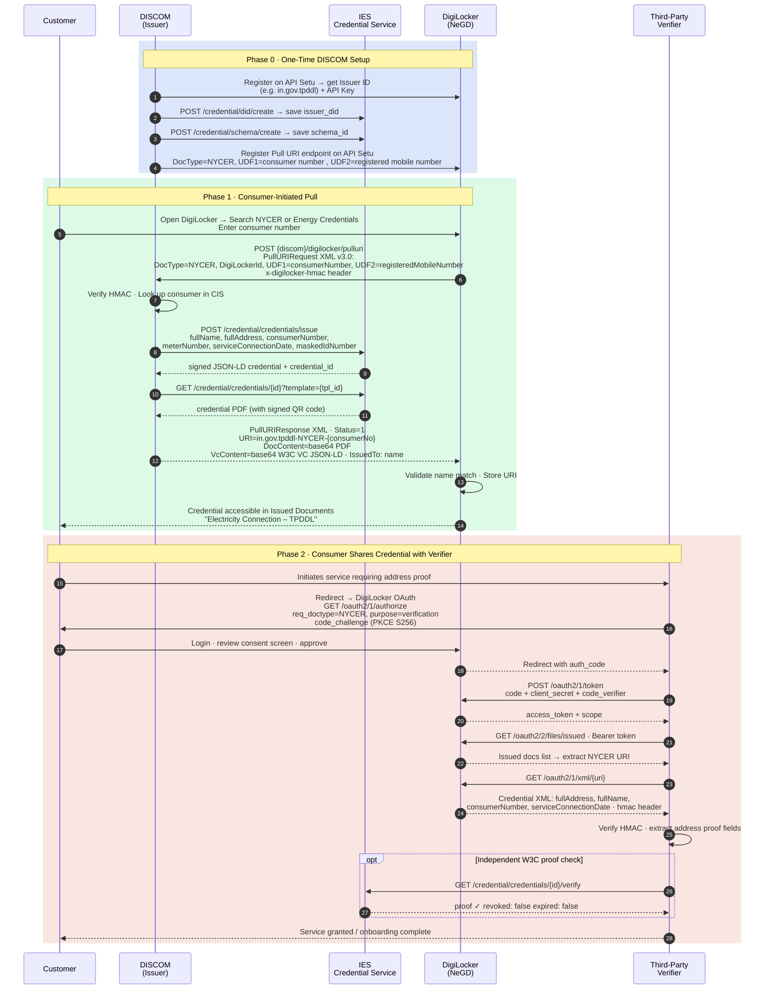

# DigiLocker Integration — DISCOM Implementation Guide

**India Energy Stack · Energy Credentials**  

---

## What This Guide Covers

Everything your DISCOM needs to do to integrate with DigiLocker so consumers can pull their IES Energy Credential into their DigiLocker account and share it as digital address proof.

**Your integration surface is a single inbound API endpoint.** DigiLocker calls it. You respond. That is the entire DigiLocker integration. Everything else is setup and registration.

---

## Pre Requisits
- [Discom Credentials Onboarding (ppt)](https://fsrglobaladmin.sharepoint.com/:p:/s/FSRG/IQCpbMz0JfIvRb2ENnlZlC49AcRYpg4q9pXiDpDfvo7Q0kc?e=rv3Klt)
- VC credenial and PDF created (see [postman collection to create credentials](https://fsrglobaladmin.sharepoint.com/:u:/s/FSRG/IQAOQcWtB6JzQobtt91va2oZAaNny8bhbkGh_cizrV5v0qc?e=pUUxti))

## Flow Overview



---

## Phase 0 · One-Time Setup

### Step 1 — Register on API Setu as a DigiLocker Issuer

Go to [https://apisetu.gov.in](https://apisetu.gov.in) and register your organisation as a document issuer. On successful registration you receive an `issuer_id` (e.g. `in.gov.tpddl`) and an `api_key`.

> **If your DISCOM is already on DigiLocker:** contact NeGD/Chikan to retrieve your existing `issuer_id` and `api_key`. You do not re-register — you add the new NYCER document type to your existing account.

---


### Step 2 — Set Up Your IES Issuer Identity

Use the IES Postman Collection to run two one-time calls against the IES Credential Service: one to generate your DISCOM's Issuer DID, and one to register the Utility Customer credential schema. The IES team will walk you through both. Save the `issuer_did` and `schema_id` you get back — you will pass them in every credential issuance request at runtime.

---

### Step 3 — Build and Register the Pull URI Endpoint

> **If your DISCOM is already on DigiLocker for ELBIL :** You can choose to use your existing URI endpoint for both ELBIL and NYCER.  If so - use the DocType in the request data.  See [Using a common URI for existing electricity bill (ELBIL) and the new credential (NYCER)](#using-a-common-uri-for-existing-electricity-bill-elbil-and-the-new-credential-nycer)

Build the endpoint described in Phase 1 below, then register it on API Setu:

| Field | Value |
|---|---|
| Endpoint URL | `https://{your-domain}/digilocker/pulluri` |
| HTTP Method | `POST` |
| Content-Type | `application/xml` |
| DocType | `NYCER` |
| UDF1 Label | `Consumer Number` |
| UDF2 Label | `Registered Mobile Number` |

Once registered, DigiLocker will call this endpoint whenever a consumer requests their NYCER document.

---

## Phase 1 · The Pull URI Endpoint

This is the only endpoint your DISCOM builds and hosts. DigiLocker calls it; you look up the consumer, call IES to issue a signed credential, and return it in the response.

```
POST https://{your-domain}/digilocker/pulluri
Content-Type: application/xml
x-digilocker-hmac: <see authentication below>
```

---

### Authentication — Verifying the Inbound HMAC

**Verify the `x-digilocker-hmac` header before doing anything else. Reject requests that fail with HTTP 401.**

DigiLocker computes the HMAC as:
```
HMAC = Base64( HMAC-SHA256( key=api_key, message=raw_request_body ) )
```

Verify it in your handler:

```python
import hmac, hashlib, base64

def verify_digilocker_hmac(request_body: bytes, api_key: str, received_hmac: str) -> bool:
    expected = base64.b64encode(
        hmac.new(api_key.encode(), request_body, hashlib.sha256).digest()
    ).decode()
    return hmac.compare_digest(expected, received_hmac)  # constant-time — prevents timing attacks
```

---

### Inbound Request — PullURIRequest XML

```xml
<?xml version="1.0" encoding="UTF-8" standalone="yes"?>
<PullURIRequest ver="3.0"
                ts="2026-03-12T10:30:00+05:30"
                txn="TXN-20260312-001"
                orgId="tpddl"
                keyhash="sha256_of_apikey_and_ts">
  <DocDetails>
    <DocType>NYCER</DocType>
    <DigiLockerId>7a3f9b2c-1e4d-4f8a-b6c2-0d5e8f1a2b3c</DigiLockerId>
    <UDF1>TPDDL-2025-001234567</UDF1>     <!-- consumer number — your lookup key -->
    <UDF2>9876543210</UDF2>               <!-- registered mobile number — secondary verification -->
    <UID>d41d8cd98f00b204e980099ecf8427e</UID>  <!-- MD5 of Aadhaar, optional -->
    <FullName>Priya Sharma</FullName>            <!-- optional -->
  </DocDetails>
</PullURIRequest>
```

| Field | Required | Description |
|---|---|---|
| `ver` | Yes | Always `3.0` |
| `ts` | Yes | Request timestamp — echo back in response |
| `txn` | Yes | Transaction ID — echo back in response |
| `orgId` | Yes | Your org ID from API Setu |
| `keyhash` | Yes | SHA256 of `(api_key + ts)` — secondary integrity check |
| `DocType` | Yes | `NYCER` |
| `DigiLockerId` | Yes | 36-char UUID identifying the consumer's DigiLocker account |
| `UDF1` | Yes | Consumer number — your primary CIS lookup key |
| `UDF2` | Yes | Registered mobile number as per utility records — secondary verification |
| `UID` | No | MD5-hashed Aadhaar number |
| `FullName` | No | Used by DigiLocker for name-match validation |

---

### Handler Logic

```
1. Read raw request body (keep raw bytes for HMAC verification)
2. Verify x-digilocker-hmac → reject HTTP 401 if invalid
3. Parse XML → extract UDF1 (consumer number) and UDF2 (registered mobile number)
4. Look up consumer in your CIS / billing database
5. If not found → return PullURIResponse Status=0 with error message
6. Call IES Credential Service to issue and sign the credential
7. Call IES Credential Service to retrieve the credential as a PDF
8. Build and return PullURIResponse XML
```

**Steps 6 and 7 — calling IES:** pass the consumer's fields (name, address, meter number, service connection date, masked ID) to the IES issue endpoint and receive back a signed credential ID and a PDF. The IES team provides the endpoint URLs, API key, and Postman Collection. There is no DigiLocker-specific logic in these calls.

---

### Outbound Response — PullURIResponse XML

This is what you return to DigiLocker. It must be well-formed XML with `Content-Type: application/xml`.

**Success (Status=1):**

```xml
<?xml version="1.0" encoding="UTF-8" standalone="yes"?>
<PullURIResponse ver="3.0"
                 ts="2026-03-12T10:30:00+05:30"
                 txn="TXN-20260312-001"
                 orgId="tpddl">
  <ResponseStatus Status="1"
                  ts="2026-03-12T10:30:00+05:30"
                  txn="TXN-20260312-001"/>
  <DocDetails>
    <DocType>NYCER</DocType>
    <URI>in.gov.tpddl-NYCER-TPDDL-2025-001234567</URI>
    <IssuedTo>
      <Person name="Priya Sharma"/>
    </IssuedTo>
    <DocContent format="pdf">
      <!-- Base64-encoded version of the PDF-->
      JVBERi0xLjQKJeLjz9MKMSAwIG9iago8PAovVHlwZSAvQ2F0YWxvZw==...
    </DocContent>
    <VcContent>
      <!-- base64-encoded W3C Verifiable Credential JSON-LD -->
      eyJAY29udGV4dCI6WyJodHRwczovL3d3dy53My5vcmcvMjAxOC9jcmVkZW50aWFscy92MSIs...
    </VcContent>
    <VcType>
      application/ld+json
    </VcType>
    <DataContent>
      <!-- Base64-encoded XML certificate data (shown decoded below for clarity).
           Encode the XML block as UTF-8 bytes → Base64 before embedding.
           This carries the same credential fields as VcContent but in
           DigiLocker-standard XML Certificate format, without the proof block. -->
      <!--
<?xml version="1.0" encoding="utf-8"?>
<Certificate language="99"
             name="Electricity Connection Certificate"
             type="NYCER"
             number="TPDDL-2025-001234567"
             issueDate="12-03-2026"
             status="A">
  <IssuedBy>
    <Organization name="TPDDL" type="NG">
      <Address type="official"
               line1="TPDDL Corporate Office"
               vtc="New Delhi"
               state="Delhi"
               country="IN"/>
    </Organization>
  </IssuedBy>
  <IssuedTo>
    <Person name="Priya Sharma" gender="F">
      <Address type="present"
               line1="42, 3rd Cross, Shakti Nagar"
               line2="North Delhi"
               vtc="Delhi"
               state="Delhi"
               pin="110007"
               country="IN"/>
    </Person>
  </IssuedTo>
  <CertificateData>
    <EnergyConnection consumerNumber="TPDDL-2025-001234567"
                      meterNumber="MET-2025-789456"
                      serviceConnectionDate="01-09-2018"
                      maskedIdNumber="XXXX-XXXX-4523"/>
  </CertificateData>
  <Signature/>
</Certificate>
      -->
      PD94bWwgdmVyc2lvbj0iMS4wIiBlbmNvZGluZz0idXRmLTgiPz4KPENlcnRpZmljYXRlIG...
    </DataContent>
  </DocDetails>
</PullURIResponse>
```

**Error (Status=0):**

```xml
<PullURIResponse ver="3.0" ts="2026-03-12T10:30:00+05:30"
                 txn="TXN-20260312-001" orgId="tpddl">
  <ResponseStatus Status="0"
                  ts="2026-03-12T10:30:00+05:30"
                  txn="TXN-20260312-001">
    <ErrorMessage>Consumer number TPDDL-2025-999 not found</ErrorMessage>
  </ResponseStatus>
</PullURIResponse>
```

---

#### `ResponseStatus`

Echo back `ts` and `txn` from the request exactly as received.

| Status | Meaning |
|---|---|
| `1` | Success — credential returned |
| `0` | Error — include `<ErrorMessage>` with a plain-language reason |
| `9` | Pending — credential issuance in progress (avoid; prefer synchronous response) |

---

#### `URI`

A stable identifier for this credential within DigiLocker. DigiLocker uses it to index the document in the consumer's account, and verifiers use it to fetch the credential later. It must be deterministic for the same consumer number.

```
Format:   in.gov.{issuer_id}-{DocType}-{consumer_number}
Example:  in.gov.tpddl-NYCER-TPDDL-2025-001234567
```

Rules: alphanumeric, hyphens, and dots only. Consumer number must be URL-safe (no spaces). Max 255 characters.

---

#### `IssuedTo`

DigiLocker performs a name-match between the `name` attribute here and the name on the consumer's DigiLocker account before storing the document. If the match fails, the document is rejected.

```xml
<IssuedTo>
  <Person name="Priya Sharma"/>
</IssuedTo>
```

Use the name exactly as it appears in your CIS. 

---

#### `DocContent`

The credential as a Base64-encoded PDF. This is the human-readable document the consumer sees in DigiLocker. It is the PDF returned by the IES Credential Service — it contains an embedded signed QR code for offline verification.

```xml
<DocContent format="pdf">
  JVBERi0xLjQKJeLjz9MKMSAwIG9iago...
</DocContent>
```

Simply Base64-encode the raw PDF bytes from the IES response and place them here.

---

#### `VcContent`

The signed W3C Verifiable Credential as a Base64-encoded JSON-LD document. This is the machine-readable payload verifiers parse when they fetch the credential via DigiLocker. It carries the `proof` block from the IES Credential Service, which enables cryptographic verification without calling back to IES.

Serialize the JSON below exactly as returned by the IES issuance response, then Base64-encode the UTF-8 bytes and place the result here. Do **not** strip or re-encode the `proof` block — doing so invalidates the signature.

```json
{
  "@context": [
    "https://www.w3.org/2018/credentials/v1",
    "https://anusree-j.github.io/vc_context/energy/utility-customer-context.json",
    "https://w3id.org/security/suites/ed25519-2020/v1"
  ],
  "id": "did:rcw:4cbe939d-1d4e-4b98-8afc-8d79a1e1902a",
  "type": ["VerifiableCredential", "UtilityCustomerCredential"],
  "issuer": "did:rcw:89f057e1-ecb1-415c-ae8e-3c85a2a47896",
  "issuanceDate": "2026-03-12T10:30:00.000Z",
  "expirationDate": "2027-03-12T23:59:59.000Z",
  "credentialSubject": {
    "id": "did:rcw:customer-priya-sharma",
    "type": "UtilityCustomerCredential",
    "fullName": "Priya Sharma",
    "issuerName": "TPDDL",
    "fullAddress": "42, 3rd Cross, Shakti Nagar, North Delhi, Delhi 110007",
    "meterNumber": "MET-2025-789456",
    "consumerNumber": "TPDDL-2025-001234567",
    "maskedIdNumber": "XXXX-XXXX-4523",
    "serviceConnectionDate": "2018-09-01"
  },
  "proof": {
    "type": "Ed25519Signature2020",
    "created": "2026-03-12T10:30:00Z",
    "proofValue": "z5wQZugiEGc2tNyJJPih1WiMZgEwTeg9zueJLgUquVX1coRgbNd1Z4JLitz89JbavQNr3z6ZKr5H4ABAMCAqD1uhp",
    "proofPurpose": "assertionMethod",
    "verificationMethod": "did:rcw:89f057e1-ecb1-415c-ae8e-3c85a2a47896#key-0"
  }
}
```

The `id`, `issuer`, `issuanceDate`, `expirationDate`, `credentialStatus`, `credentialSubject`, and `proof` fields all come directly from the IES issuance response. Pass them through verbatim. Verifiers can independently verify the proof offline using the `verificationMethod` key, or call `GET /credential/credentials/{id}/verify` on the IES Credential Service for a live revocation + expiry check.

---

#### `DataContent`

The credential data as a Base64-encoded XML document in DigiLocker's standard Certificate format. This is the machine-readable XML payload that DigiLocker-native consumers and requesters can parse using the common DLTS certificate schema. It carries the same credential fields as `VcContent` but **without the proof block** — the `Signature` element is left empty, as the cryptographic proof is carried in `VcContent`.

Construct the XML below, then Base64-encode the UTF-8 bytes and place the result here.

```xml
<?xml version="1.0" encoding="utf-8"?>
<Certificate language="99"
             name="Electricity Connection Certificate"
             type="NYCER"
             number="{consumerNumber}"
             issueDate="{DD-MM-YYYY}"
             status="A">
  <IssuedBy>
    <Organization name="{issuerName}" type="NG">
      <Address type="official"
               vtc="{city}"
               state="{state}"
               country="IN"/>
    </Organization>
  </IssuedBy>
  <IssuedTo>
    <Person name="{fullName}" gender="{M/F/T}">
      <Address type="present"
               line1="{addressLine1}"
               line2="{addressLine2}"
               vtc="{city}"
               state="{state}"
               pin="{pincode}"
               country="IN"/>
    </Person>
  </IssuedTo>
  <CertificateData>
    <EnergyConnection consumerNumber="{consumerNumber}"
                      meterNumber="{meterNumber}"
                      serviceConnectionDate="{DD-MM-YYYY}"
                      maskedIdNumber="{maskedIdNumber}"/>
  </CertificateData>
  <Signature/>
</Certificate>
```

**`EnergyConnection` attributes:**

| Attribute | Source field | Description |
|---|---|---|
| `consumerNumber` | `credentialSubject.consumerNumber` | Consumer's unique account number with the DISCOM |
| `meterNumber` | `credentialSubject.meterNumber` | Installed meter identifier |
| `serviceConnectionDate` | `credentialSubject.serviceConnectionDate` | Date of service connection in DD-MM-YYYY format |
| `maskedIdNumber` | `credentialSubject.maskedIdNumber` | Partially masked identity reference (e.g. Aadhaar last 4) |

All field values come directly from the IES issuance response `credentialSubject`. The `<Signature/>` element is intentionally empty — the authoritative cryptographic proof is in `VcContent`.

---

## Security Considerations

In order to prevent only legitimate users from accessing credentials, appropriate security checks must be performed by the API.  Follow below recomendations.  These need to be configured in the DigiLocker API registration.

- *Must* use the consumer identifier issued by DISCOM (as a UDF)
- *Consider* additional fields such as registered mobile number or other details (as a UDF)
- *Consider* AADHAAR match, AADHAAR name match
- *Consider* OTP authentication flow.  Setup OTP as an optional UDF and follow the 2 step pull process
 ---

## DISCOM Checklist

```
Phase 0 — One-Time Setup
────────────────────────────────────────────────────────────────────────────
[ ] 1.  Confirm NYCER doctype code 
[ ] 2.  Register on API Setu (or retrieve existing Issuer ID + API Key)
[ ] 3.  Complete IES setup via Postman Collection (Issuer DID + schema)
[ ] 4.  Build Pull URI endpoint
[ ] 5.  Deploy to a publicly reachable HTTPS URL
[ ] 6.  Register endpoint on API Setu (DocType=NYCER, UDF1=consumer number, UDF2=registered mobile number)
[ ] 7.  Confirm security considerations are in place to provide access to legitimate users

Phase 1 — Integration Testing
────────────────────────────────────────────────────────────────────────────
[ ] 8.  Test HMAC verification with a sample request from the IES team
[ ] 9.  End-to-end test: DigiLocker sandbox calls Pull URI →
        credential appears in test consumer DigiLocker account
[ ] 10.  Verify DocContent PDF opens correctly and QR code is scannable
[ ] 11. Verify VcContent JSON-LD VC contains all required credential fields and a valid proof block
[ ] 12. Verify DataContent XML parses correctly and EnergyConnection attributes match VcContent credentialSubject fields
[ ] 13. Confirm IssuedTo name-match passes DigiLocker validation

```

## Example Code

### Using a common URI for existing electricity bill (ELBIL) and the new credential (NYCER)

If the same URI is used for both - the DocType can be used to make the distinction.

Note: Key differences between NYCER and ELBIL return data
- The credential NYCER requires VcData and VcType to be added.  
- The PDF is the PDF equivalent to the VC

```python
@app.route('/digilocker/pulluri', methods=['POST'])
def pull_uri():
    xml_data = request.data
    doc_type = parse_xml(xml_data, 'DocType') # Extract ENCON dynamically
    
    if doc_type == "ENCON":
        # Run logic for Electricity Connection
        return handle_encon_request(xml_data)
    elif doc_type == "ELBIL":
        # Run logic for Electricity Bill
        return handle_bill_request(xml_data)
```

---

## Support

Implementation support: **India Energy Stack programme team**  
DigiLocker / API Setu queries: apisetu.support@digitalindia.gov.in [https://apisetu.gov.in](https://apisetu.gov.in)
