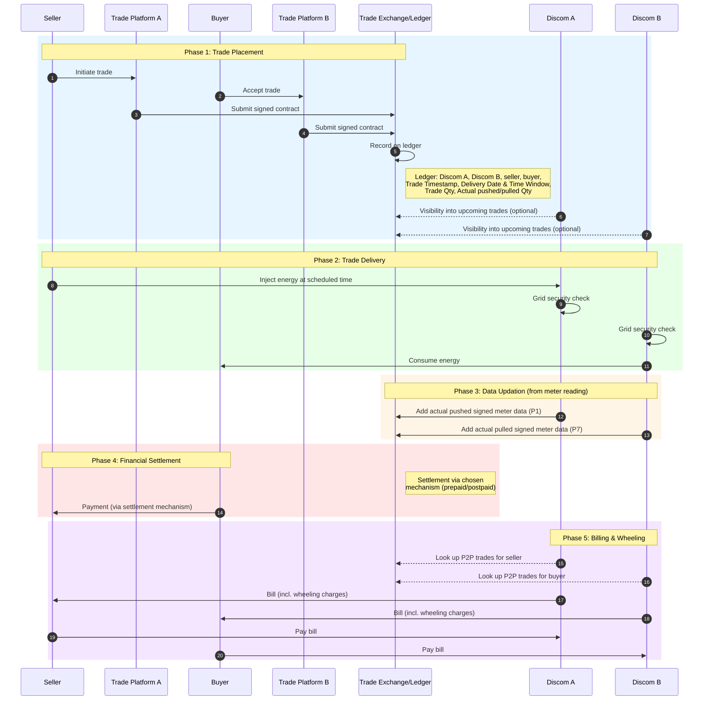

# Inter-Discom P2P Energy Trading in India

> **Full specification for P2P trading:** [DEG - P2P trading.md](https://github.com/Beckn-One/DEG/blob/main/docs/implementation-guides/v2/P2P_Trading/P2P_Trading_implementation_guide_DRAFT.md)

> **Specification for inter Discom P2P trading:** [DEG - Inter Distributor P2P trading.md](https://github.com/Beckn-One/DEG/blob/main/docs/implementation-guides/v2/P2P_Trading/Inter%20energy%20retailer%20P2P%20trading_draft.md)

This document provides contextualization for inter-discom P2P energy trading. 

In India, the **Discom** (Distribution Company) combines both roles defined in the main specification:

| Main Spec Actor | India Equivalent |
|-----------------|------------------|
| Energy retailer (consumer-facing) | Discom |
| Energy distribution company (wire/infra) | Discom |

Therefore, the actor set simplifies to:

| # | Actor | Examples |
|---|-------|----------|
| 1 | **Discom(s)** | BSES, Tata Power, MSEDCL, BESCOM, etc. |
| 2 | **Buyer** | Prosumer consuming P2P energy |
| 3 | **Seller** | Prosumer producing P2P energy |
| 4 | **Trade platform(s)** | Consumer-facing apps |
| 5 | **Trade exchange(s)** | Permissioned ledger/ Permissioned ledger operator |

---

## Overall Flow (India)

---

## Ledger Data Structure

The trade exchange/ledger records the following for each trade:

| Field | Description | Updated by |
|-------|-------------|------------|
| Seller Discom ID | Discom of the seller (e.g., D1) | Trade Platform |
| Seller ID | Prosumer ID of the seller (e.g., P1) | Trade Platform |
| Buyer Discom ID | Discom of the buyer (e.g., D2) | Trade Platform |
| Buyer ID | Consumer ID of the buyer (e.g., C1) | Trade Platform |
| Trade Timestamp | When the trade was placed | Trade Platform |
| Delivery Time, Date Window | Scheduled delivery date and time window| Trade Platform |
| Units | Contracted quantity | Trade Platform |
| Actual Pushed | Actual units pushed by seller (from meter data) | Discom |
| Actual Consumed | Actual units consumed by buyer (from meter data) | Discom |

---

## Financial Settlement

The financial settlement of the trade between the buyer and seller is facilitated through trade platforms. Platforms can explore various models depending on the nature of trade, reputation of users, and business case:

- **Prepaid models**: Clearing house, escrow model
- **Postpaid models**: Invoice generation and collection based on actual delivered quantities

This settlement is independent of the discom's billing process.

---

## Enforcement (if default)

Enforcement is handled outside the main trading and fulfillment flow. Mechanisms include:

- **Trade Platform Level**: Platforms can implement penalties, reputation downgrades, escrow forfeiture, or suspension for users who default on payments or fail to deliver contracted energy. This architecture does not prevent discoms also from implementing any enforcement mechanisms at a later date.
- **Ledger Visibility**: The trade exchange provides transparency into defaults, enabling platforms and discoms to take informed action.

---

## Resources

- [Sample spreadsheet with bill calculations](https://docs.google.com/spreadsheets/d/1ZXdvUnLshdOmiaqJJQuONigPK_KnTZ3Pq8aiLWYClaA/edit?usp=sharing)
